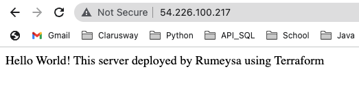

# Coding Challenge - 002 : Create Resources on AWS (Terraform)

Purpose of the this coding challenge is to write a terraform configuration files that crates the required resources.

  
## Problem Statement

- Create 2 ec2 instance
  
    * ami: Amazon Linux 2 (use data source to fetch the ami)

    * instance type: t2.micro

    * ec2 tags :  "Name: Terraform First Instance"
                  "Name: Terraform Second Instance"

    * Install Apache server and start it

    *  Write "Hello World" to the /var/www/html/index.html

- Create a Security Group and connect it to our instances

    * inbound rules: open 22 and 80 ports

    * outbound rules: open anywhere

- Create a file name "public.txt" and write your public ip's to the file

- Create a file name "private.txt" and write your private ip's to the file

- Create an output in the terminal and display your public ip's when you create your infrastructure

