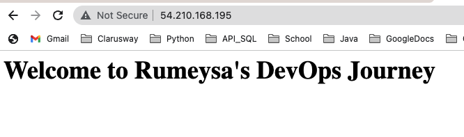
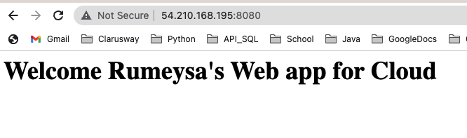
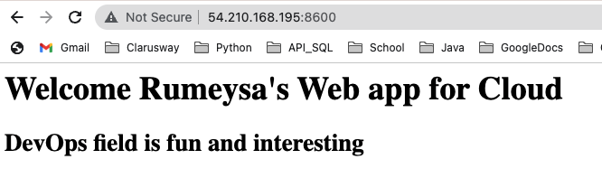

# Hands-on Docker-05 : Docker Image Basic Operations

Purpose of this hands-on training is to give the students understanding to images in Docker.

## Learning Outcomes

At the end of the this hands-on training, students will be able to;

- explain what Docker image is.

- explain Docker image layers.

- list images in Docker.

- explain Docker Hub.

- have a Docker Hub account and create a repository.

- pull Docker images.

- explain image tags.

- inspect Docker image.

- search for Docker images.

- explain what the Dockerfile is.

- build images with Dockerfile.

- push images to Docker Hub.

- delete Docker images.

## Outline

- Part 1 - Launch a Docker Machine Instance and Connect with SSH

- Part 2 - Using Docker Image Commands and Docker Hub

- Part 3 - Building Docker Images with Dockerfile

## Part 1 - Launch a Docker Machine Instance and Connect with SSH

- Launch a Docker machine on Amazon Linux 2 AMI with security group allowing SSH connections using the [Cloudformation Template for Docker Machine Installation](../docker-01-installing-on-ec2-linux2/docker-installation-template.yml).

- Connect to your instance with SSH.

```bash
ssh -i .ssh/call-training.pem ec2-user@ec2-3-133-106-98.us-east-2.compute.amazonaws.com
```

## Part 2 - Using Docker Image Commands and Docker Hub

- Explain what the Docker Hub is.

- Sign up to Docker Hub and explain the UI.

- Create a repository with the name of `flask-app` and description of `This image repo holds Flask apps.`.

- Check if the docker service is up and running on EC2 instance.

```bash
systemctl status docker
```

- List images in Docker and explain properties of images.

```bash
docker image ls
```

- Download Docker image `ubuntu` and explain image tags (defaults to `latest`) on Docker Hub. Show `ubuntu` repo on Docker Hub and which version the `latest` tag corresponds to (`20.04`).

```bash
# Defaults to ubuntu:latest
docker image pull ubuntu
docker image ls
```

- Run `ubuntu` as container with interactive shell open.

```bash
docker run -it ubuntu
```

- Display the `ubuntu` os info on the container (`VERSION="20.04 LTS (Focal Fossa)"`) and note that the `latest` tag is showing release `20.04` as in the Docker Hub. Then exit the container.

```bash
cat /etc/os-release
exit
```

- Download earlier version (`18.04`) of `ubuntu` image, which is tagged as `18.04` on Docker Hub and explain image list.

```bash
docker image pull ubuntu:18.04
docker image ls
```

- Inspect `ubuntu` image and explain properties.

```bash
# Defaults to ubuntu:latest
docker image inspect ubuntu
# Ubuntu with tag 18.04
docker image inspect ubuntu:18.04
```

- Search for Docker Images both on `bash` and on Docker Hub. 
  
```bash
docker search ubuntu
```

## Part 3 - Building Docker Images with Dockerfile

- Build an image of Python Flask app with Dockerfile based on `python:alpine` image and push it to the Docker Hub.

- Create a folder to hold all files necessary for creating Docker image.

```bash
mkdir clarusway_web
cd clarusway_web
```

- Create application code and save it to file, and name it `welcome.py`

```bash
echo '
from flask import Flask
app = Flask(__name__)
@app.route("/")
def hello():
    return "<h1>Welcome to Clarusway</h1>"
if __name__ == "__main__":
    app.run(host="0.0.0.0", port=80)
' > welcome.py
```

- Create a Dockerfile listing necessary packages and modules, and name it `Dockerfile`.

```Dockerfile
FROM ubuntu
RUN apt-get update -y
RUN apt-get install python3 -y
RUN apt-get install python3-pip -y
RUN pip3 install flask
COPY . /app
WORKDIR /app
CMD python3 ./welcome.py
```

- Build Docker image from Dockerfile locally, tag it as `<Your_Docker_Hub_Account_Name>/<Your_Image_Name>:<Tag>` and explain steps of building. Note that repo name is the combination of `<Your_Docker_Hub_Account_Name>/<Your_Image_Name>`.

```bash
docker build -t "rumeysakdogan/flask-app:1.0" .
docker image ls
```

- Run the newly built image as container in detached mode, connect host `port 80` to container `port 80`, and name container as `welcome`. Then list running containers and connect to EC2 instance from the browser to show the Flask app is running.

```bash
docker run -d --name welcome -p 80:80 rumeysakdogan/flask-app:1.0
docker container ls
```

- Login in to Docker with credentials.

```bash
docker login
```

- Push newly built image to Docker Hub, and show the updated repo on Docker Hub.

```bash
docker push rumeysakdogan/flask-app:1.0
```

- This time, we reduce the size of image.

- Create a Dockerfile listing necessary packages and modules, and name it `Dockerfile-alpine`
  
```Dockerfile
FROM python:alpine
RUN pip install flask
COPY . /app
WORKDIR /app
EXPOSE 80
CMD python ./welcome.py
```

- Build Docker image from Dockerfile locally, tag it as `<Your_Docker_Hub_Account_Name>/<Your_Image_Name>:<Tag>` and explain steps of building. Note that repo name is the combination of `<Your_Docker_Hub_Account_Name>/<Your_Image_Name>`.

```bash
docker build -t "rumeysakdogan/flask-app:2.0" -f ./Dockerfile-alpine . 
docker image ls
```

- Note that while the size of `rumeysakdogan/flask-app:1.0` is approximately 400MB, the size of `rumeysakdogan/flask-app:2.0` is 56MB.

- Run the newly built image as container in detached mode, connect host `port 80` to container `port 80`, and name container as `welcome`. Then list running containers and connect to EC2 instance from the browser to show the Flask app is running.

```bash
docker run -d --name welcome -p 8080:80 rumeysakdogan/flask-app:2.0
docker ps
```

- Stop and remove the container `welcome`.

```bash
docker stop welcome && docker rm welcome
```

- Push newly built image to Docker Hub, and show the updated repo on Docker Hub.

```bash
docker push rumeysakdogan/flask-app:2.0
```

- We can also tag the same image with different tags.

```bash
docker image tag rumeysakdogan/flask-app:2.0 rumeysakdogan/flask-app:latest
```

- Delete image with `image id` locally.

```bash
docker image rm 497
```

Create another Docker file to run an nginx server
```sh
FROM nginx:alpine
WORKDIR /usr/share/nginx/html/
COPY ./index.html .
```
Build an image with version 1.0 and run it on port 8080
```sh
docker build -t rumeysakdogan/nginx-web:1.0 .
```


Change index.html and create a new image with version 2.0, run new image on port 8600

```sh
docker build -t rumeysakdogan/nginx-web:2.0 .
docker run -d --name webpage -p 8600:80 rumeysakdogan/nginx-web:2.0 
```

