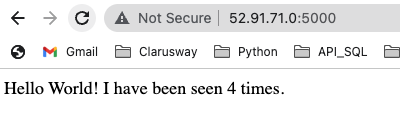
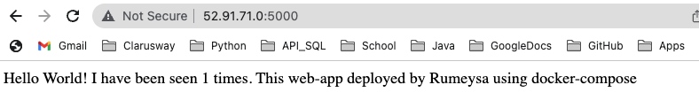

# Hands-on Docker-06 : Docker Compose Operations

Purpose of the this hands-on training is to give the students understanding to Docker Compose.

## Learning Outcomes

At the end of the this hands-on training, students will be able to;

- explain what Docker Compose is.

- install docker-compose-cli

- explain what the `docker-compose.yml` is.

- build a simple Python web application running on Docker Compose.

## Outline

- Part 1 - Launch a Docker Machine Instance and Connect with SSH

- Part 2 - Installing Docker Compose

- Part 3 - Building a Web Application using Docker Compose

## Part 1 - Launch a Docker Machine Instance and Connect with SSH

- Launch a Docker machine on Amazon Linux 2 AMI with security group allowing SSH connections using the [Cloudformation Template for Docker Machine Installation](../docker-01-installing-on-ec2-linux2/docker-installation-template.yml).

- Connect to your instance with SSH.

```bash
ssh -i .ssh/call-training.pem ec2-user@ec2-3-133-106-98.us-east-2.compute.amazonaws.com
```

## Part 2 - Installing Docker Compose

- For Linux systems, after installing Docker, you need install Docker Compose separately. But, Docker Desktop App for Mac and Windows includes `Docker Compose` as a part of those desktop installs.

- Download the current stable release of `Docker Compose` executable.

```bash
sudo curl -L "https://github.com/docker/compose/releases/download/1.29.2/docker-compose-$(uname -s)-$(uname -m)" \
-o /usr/local/bin/docker-compose
```

- Apply executable permissions to the binary:

```bash
sudo chmod +x /usr/local/bin/docker-compose
```

- Check if the `Docker Compose`is working. Should see something like `docker-compose version 1.26.2, build 1110ad01`

```bash
docker-compose --version
```

## Part 3 - Building a Web Application using Docker Compose

- Create a folder for the project:
  
```bash
mkdir composetest
cd composetest
```

- Create a file called `app.py` in your project folder and paste the following python code in it. In this example, the application uses the Flask framework and maintains a hit counter in Redis, and  `redis` is the hostname of the `Redis container` on the application’s network. We use the default port for Redis, `6379`.

```python
import time

import redis
from flask import Flask

app = Flask(__name__)
cache = redis.Redis(host='redis', port=6379)


def get_hit_count():
    retries = 5
    while True:
        try:
            return cache.incr('hits')
        except redis.exceptions.ConnectionError as exc:
            if retries == 0:
                raise exc
            retries -= 1
            time.sleep(0.5)


@app.route('/')
def hello():
    count = get_hit_count()
    return 'Hello World! I have been seen {} times.\n'.format(count)
```

- Create another file called `requirements.txt` in your project folder, add `flask` and `redis` as package list.

```bash
echo '
flask
redis
' > requirements.txt
```

- Create a Dockerfile which builds a Docker image and explain what it does.

```text
The image contains all the dependencies for the application, including Python itself.
1. Build an image starting with the Python 3.7 image.
2. Set the working directory to `/code`.
3. Set environment variables used by the flask command.
4. Install gcc and other dependencies
5. Copy `requirements.txt` and install the Python dependencies.
6. Add metadata to the image to describe that the container is listening on port 5000
7. Copy the current directory `.` in the project to the workdir `.` in the image.
8. Set the default command for the container to flask run.
```

```bash
echo '
FROM python:3.7-alpine
WORKDIR /code
ENV FLASK_APP app.py
ENV FLASK_RUN_HOST 0.0.0.0
RUN apk add --no-cache gcc musl-dev linux-headers
COPY requirements.txt requirements.txt
RUN pip install -r requirements.txt
EXPOSE 5000
COPY . .
CMD ["flask", "run"]
' > Dockerfile
```

- Create a file called `docker-compose.yml` in your project folder and define services and explain services.

```text
This Compose file defines two services: web and redis.

### Web service
The web service uses an image that’s built from the Dockerfile in the current directory. It then binds the container and the host machine to the exposed port, 5000. This example service uses the default port for the Flask web server, 5000.

### Redis service
The redis service uses a public Redis image pulled from the Docker Hub registry.
```

```bash
echo '
version: "3"
services:
  web:
    build: .
    ports:
      - "5000:5000"
  redis:
    image: "redis:alpine"
' > docker-compose.yml
```

- Build and run your app with `Docker Compose` and explains what is happening.

```text
Docker compose pulls a Redis image, builds an image for our the app code,
and starts the services defined. In this case, the code is statically copied into the image at build time.
```

```bash
docker-compose up
```

- Add a rule within the security group of Docker Instance allowing TCP connections through port `5000` from anywhere in the AWS Management Console.

```text
Type        : Custom TCP
Protocol    : TCP
Port Range  : 5000
Source      : 0.0.0.0/0
Description : -
```

- Enter http://`ec2-host-name`:5000/ in a browser to see the application running.



- Open an other terminal and connect to EC2 instance. 


- Run either `docker-compose` or `docker-compose help` to see the help docs about docker-compose commands.

```bash
docker-compose help | less
```

- Run `docker-compose ps` command. Notice that it will not work, produces an error. Mention that docker-compose commands must be implemented in related directory.

```bash
cd composetest
docker-compose ps
```

- Change directory to "composetest" and run `docker-compose ps` command to see the containers. Show the naming convention of docker-compose.

```bash
cd composetest
docker-compose ps
```

- Run `docker-compose images` command to see the images used for container. Show the naming convention of docker-compose.

```bash
docker-compose images
```

- Run `docker-compose config` command to see the configuration of docker-compose file. Show that it has a reverse structure.

```bash
docker-compose config
```

- Go back to the first terminal. Press `Ctrl+C` to stop containers, and run `docker ps -a` to see containers created by Docker Compose.

- Remove the containers with `Docker Compose`.

```bash
docker-compose down
```

- Run `docker ps -a` to see containers are removed.

```bash
docker ps -a
```

- Run `docker images` command to see images are not removed. Notice that images and volumes are not removed with `docker-compose down` commmand.

```bash
docker images
```

- Open "app.py" file with an editor. Change the last section as mentinoned here:

```python
@app.route('/')
def hello():
    count = get_hit_count()
    return 'Hello World!. I have been seen {} times.\nThis web-app deployed by Rumeysa using docker compose'.format(count)
```
-Save the file. And run `docker-compose up` command.

```bash
docker-compose up
```
- Enter http://`ec2-host-name`:5000/ in a browser, check if the app updated. Show that the changes do not take place on the browser. Explain that it needs `docker-compose up --build` command to refresh the image. 

- Press `Ctrl+C` to stop containers. Run `docker-compose down` command and remove the containers.

```bash
docker-compose down
```

- Run `docker-compose up --build` command to update the image. 

```bash
docker-compose up --build
```

- Enter http://`ec2-host-name`:5000/ in a browser, check if the app updated. Show that the changes took place on the browser. 


- Press `Ctrl+C` to stop containers. Run `docker-compose down` command and remove the containers.

```bash
docker-compose down
```

- Run `docker ps -a` to see containers are removed.

```bash
docker ps -a
```
