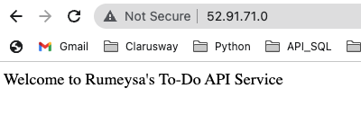
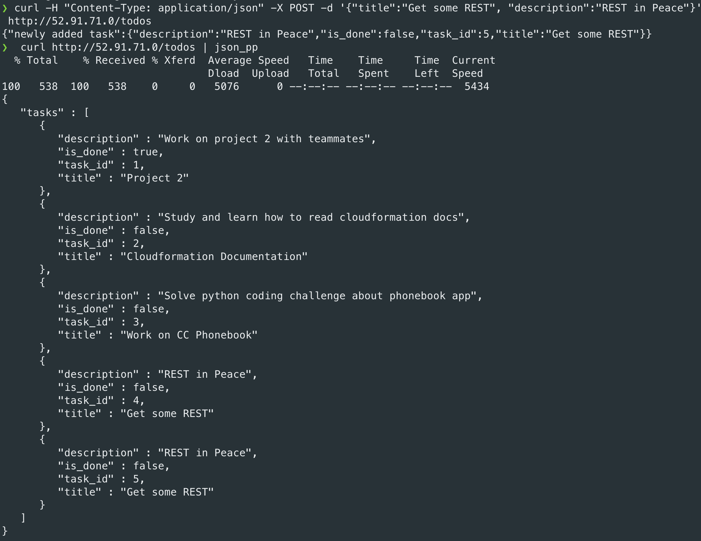
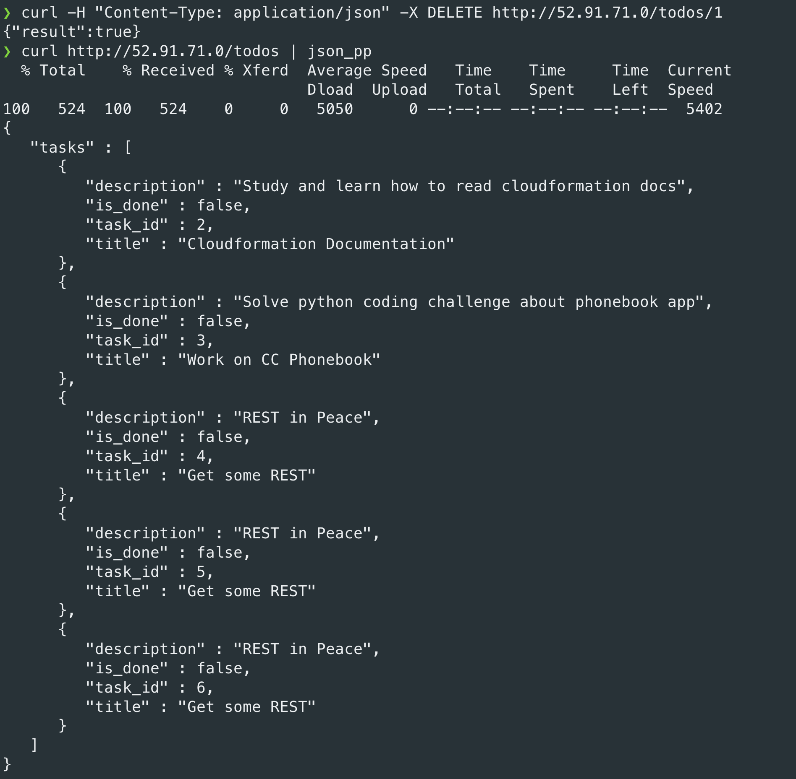

# Hands-on Docker-07 : Dockerize To-Do Web API Developed in Python Flask

Purpose of the this hands-on training is to dockerize an Python Flask application with Dockerfile and Docker compose.

## Learning Outcomes

At the end of the this hands-on training, students will be able to;

- build Docker images.

- configure Docker Compose to run Python Flask app.

## Outline

- Part 1 - Launch a Docker Machine Instance and Connect with SSH

- Part 2 - Configuring Multi Containers (Python Flask App and MySQL) with Docker Compose

## Part 1 - Launch a Docker Machine Instance and Connect with SSH

- Launch a Compose enabled Docker machine on Amazon Linux 2 AMI with security group allowing SSH connections using the [Cloudformation Template for Docker Machine Installation](./docker-compose-installation-cfn-template.yml).

- Connect to your instance with SSH.

```bash
ssh -i .ssh/call-training.pem ec2-user@ec2-3-133-106-98.us-east-2.compute.amazonaws.com
```

## Part 2 - Configuring Multi Containers (Python Flask App and MySQL) with Docker Compose

- (Optional) You can install git with: 

```
sudo yum install git -y
```

then clone the project resources from:

```
git clone https://github.com/walter-cw/todo-app-docker-compose.git
```


- Create a folder for the project and change into your project directory:
  
```bash
mkdir to-do-api
cd to-do-api
```

- Create a `to-do-api.py` with following coding. 

```bash
# Import Flask modules
from flask import Flask, jsonify, abort, request, make_response
from flaskext.mysql import MySQL

# Create an object named app
app = Flask(__name__)

# Configure mysql database
app.config['MYSQL_DATABASE_HOST'] = 'database'
app.config['MYSQL_DATABASE_USER'] = 'clarusway'
app.config['MYSQL_DATABASE_PASSWORD'] = 'Clarusway_1'
app.config['MYSQL_DATABASE_DB'] = 'todo_db'
app.config['MYSQL_DATABASE_PORT'] = 3306
mysql = MySQL()
mysql.init_app(app)
connection = mysql.connect()
connection.autocommit(True)
cursor = connection.cursor()

# Write a function named `init_todo_db` which initializes the todo db
# Create P table within sqlite db and populate with sample data
# Execute the code below only once.
def init_todo_db():
    drop_table = 'DROP TABLE IF EXISTS todo_db.todos;'
    todos_table = """
    CREATE TABLE todo_db.todos(
    task_id INT NOT NULL AUTO_INCREMENT,
    title VARCHAR(100) NOT NULL,
    description VARCHAR(200),
    is_done BOOLEAN NOT NULL DEFAULT 0,
    PRIMARY KEY (task_id)
    ) ENGINE=InnoDB DEFAULT CHARSET=utf8mb4 COLLATE=utf8mb4_unicode_ci;
    """
    data = """
    INSERT INTO todo_db.todos (title, description, is_done)
    VALUES
        ("Project 2", "Work on project 2 with teammates", 1 ),
        ("Cloudformation Documentation", "Study and learn how to read cloudformation docs", 0),
        ("Work on CC Phonebook", "Solve python coding challenge about phonebook app", 0);
    """
    cursor.execute(drop_table)
    cursor.execute(todos_table)
    cursor.execute(data)

# Write a function named `get_all_tasks` which gets all tasks from the todos table in the db,
# and return result as list of dictionary 
# `[{'task_id': 1, 'title':'XXXX', 'description': 'XXXXXX', 'is_done': 'Yes' or 'No'} ]`.
def get_all_tasks():
    query = """
    SELECT * FROM todos;
    """
    cursor.execute(query)
    result = cursor.fetchall()
    tasks =[{'task_id':row[0], 'title':row[1], 'description':row[2], 'is_done': bool(row[3])} for row in result]
    return tasks

# Write a function named `find_task` which finds task using task_id from the todos table in the db,
# and return result as list of dictionary 
# `{'task_id': 1, 'title':'XXXX', 'description': 'XXXXXX', 'is_done': 'Yes' or 'No'}`.
def find_task(id):
    query = f"""
    SELECT * FROM todos WHERE task_id={id};
    """
    cursor.execute(query)
    row = cursor.fetchone()
    task = None
    if row is not None:
        task = {'task_id':row[0], 'title':row[1], 'description':row[2], 'is_done': bool(row[3])}
    return task

# Write a function named `insert_task` which inserts task into the todos table in the db,
# and return the newly added task as dictionary 
# `{'task_id': 1, 'title':'XXXX', 'description': 'XXXXXX', 'is_done': 'Yes' or 'No'}`.
def insert_task(title, description):
    insert = f"""
    INSERT INTO todos (title, description)
    VALUES ('{title}', '{description}');
    """
    cursor.execute(insert)

    query = f"""
    SELECT * FROM todos WHERE task_id={cursor.lastrowid};
    """
    cursor.execute(query)
    row = cursor.fetchone()
    return {'task_id':row[0], 'title':row[1], 'description':row[2], 'is_done': bool(row[3])}

# Write a function named `change_task` which updates task into the todos table in the db,
# and return updated added task as dictionary 
# `{'task_id': 1, 'title':'XXXX', 'description': 'XXXXXX', 'is_done': 'Yes' or 'No'}`.
def change_task(task):
    update = f"""
    UPDATE todos
    SET title='{task['title']}', description = '{task['description']}', is_done = {task['is_done']}
    WHERE task_id= {task['task_id']};
    """
    cursor.execute(update)

    query = f"""
    SELECT * FROM todos WHERE task_id={task['task_id']};
    """
    cursor.execute(query)
    row = cursor.fetchone()
    return {'task_id':row[0], 'title':row[1], 'description':row[2], 'is_done': bool(row[3])}

# Write a function named `remove_task` which removes task from the todos table in the db,
# and returns True if successfully deleted or False.
def remove_task(task):
    delete = f"""
    DELETE FROM todos
    WHERE task_id= {task['task_id']};
    """
    cursor.execute(delete)

    query = f"""
    SELECT * FROM todos WHERE task_id={task['task_id']};
    """
    cursor.execute(query)
    row = cursor.fetchone()
    return True if row is None else False

# Write a function named `home` which returns 'Welcome to the Rumeysa's To-Do API Service',
# and assign to the static route of ('/')
@app.route('/')
def home():
    return "Welcome to Rumeysa's To-Do API Service"


# Write a function named `get_tasks` which returns all tasks in JSON format for `GET`,
# and assign to the static route of ('/todos')
@app.route('/todos', methods=['GET'])
def get_tasks():
    return jsonify({'tasks':get_all_tasks()})


# Write a function named `get_tasks` which returns the task with given task_id in JSON format for `GET`,
# and assign to the static route of ('/todos/<int:task_id>')
@app.route('/todos/<int:task_id>', methods = ['GET'])
def get_task(task_id):
    task = find_task(task_id)
    if task == None:
        abort(404)
    return jsonify({'task found': task})

# Write a function named `add_task` which adds new task using `POST` methods,
# and assign to the static route of ('/todos')
@app.route('/todos', methods=['POST'])
def add_task():
    if not request.json or not 'title' in request.json:
        abort(400)
    return jsonify({'newly added task':insert_task(request.json['title'], request.json.get('description', ''))}), 201

# Write a function named `update_task` which updates an existing task using `PUT` method,
# and assign to the static route of ('/todos/<int:task_id>')
@app.route('/todos/<int:task_id>', methods=['PUT'])
def update_task(task_id):
    task = find_task(task_id)
    if task == None:
        abort(404)
    if not request.json:
        abort(400)
    task['title'] = request.json.get('title', task['title'])
    task['description'] = request.json.get('description', task['description'])
    task['is_done'] = int(request.json.get('is_done', int(task['is_done'])))
    return jsonify({'updated task': change_task(task)})

# Write a function named `delete_task` which updates an existing task using `DELETE` method,
# and assign to the static route of ('/todos/<int:task_id>')
@app.route('/todos/<int:task_id>', methods=['DELETE'])
def delete_task(task_id):
    task = find_task(task_id)
    if task == None:
        abort(404)
    return jsonify({'result':remove_task(task)})

# Write a function named `not_found` for handling 404 errors which returns 'Not found' in JSON format.
@app.errorhandler(404)
def not_found(error):
    return make_response(jsonify({'error': 'Not found'}), 404)

# Write a function named `bad_request` for handling 400 errors which returns 'Bad Request' in JSON format.
@app.errorhandler(400)
def bad_request(error):
    return make_response(jsonify({'error': 'Bad request'}), 400)

# Add a statement to run the Flask application which can be reached from any host on port 80.
if __name__== '__main__':
    init_todo_db()
    # app.run(debug=True)
    app.run(host='0.0.0.0', port=80)
```

- Create another file called `requirements.txt` in your project folder, add the followings as package list.

```bash
flask
flask-mysql
```

- Create a Dockerfile with followings.

```bash
FROM python:alpine
COPY . /app
WORKDIR /app
RUN pip install -r requirements.txt
EXPOSE 80
CMD python ./to-do-api.py
```

- Create a file called `docker-compose.yml` in your project folder with following setup.

```yaml
version: "3.7"

services:
    database:
        image: mysql:5.7
        environment:
            MYSQL_ROOT_PASSWORD: R1234r
            MYSQL_DATABASE: todo_db
            MYSQL_USER: clarusway
            MYSQL_PASSWORD: Clarusway_1
        networks:
            - clarusnet
    myapp:
        build: .
        restart: always
        depends_on:
            - database
        ports:
            - "80:80"
        networks:
            - clarusnet

networks:
    clarusnet:
        driver: bridge
```

- Compose up your application.

```bash
docker-compose up -d
```

- List docker containers and show that there are multiple containers.

```bash
docker container ls
```

- List docker images and explain `to-do-api_myapp` as image name.

```bash
docker image ls
```

- List docker networks and explain `to-do-api_clarusnet`.

```bash
docker network ls
```

- Check if the To-Do App is running by entering `http://<ec2-host-name>` in a browser.

- Test the application.

  - List all task in  the `To Do List` API using `/todos` path and HTTP `GET` method with `curl` command.

  ```bash
  curl http://<ec2-host-name>/todos
  ```

  - Retrieve task with `id=3` using `/todos/3` path and HTTP `GET` method with `curl` command.
  
  ```bash
  curl http://<ec2-host-name>/todos/3
  ```

  - Create new task the `To Do List` using `/todos` path and HTTP `POST` method with `curl` command.

  ```bash
  curl -H "Content-Type: application/json" -X POST -d '{"title":"Get some REST", "description":"REST in Peace"}' http://<ec2-host-name>/todos
  ```
  

  - Delete task with `id=1` using `/todos/1` path and HTTP `DELETE` method with `curl` command.
  
  ```bash
  curl -H "Content-Type: application/json" -X DELETE http://<ec2-host-name>/todos/1
  ```

  - List all task in  the `To Do List` API using `/todos` path and HTTP `GET` method with `curl` command.

  ```bash
  curl http://<ec2-host-name>/todos
  ```

- Stop and remove containers, networks, images.

```bash
docker-compose down
```

- List docker images, networks, containers. Explain, since we didn't add volume to store data, when the MySQL container is gone, all data in the database will be gone also.

```bash
docker image ls
docker container ls
docker network ls
```
