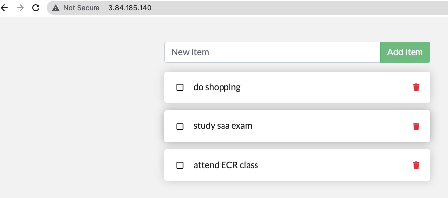

# Hands-on ECR-01 : Pushing Docker Images to ECR Manually

Purpose of the this hands-on training is to give basic understanding of how to use AWS Elastic Container Registry (ECR) and how to manage docker images using ECR.

## Learning Outcomes

At the end of the this hands-on training, students will be able to;

- prepare a Docker Machine with terraform.

- create and configure AWS ECR from the AWS Management Console.

- create and configure AWS ECR from the AWS CLI.

- demonstrate how to build a docker image with Dockerfile.

- use Docker commands effectively to tag, push, and pull images to/from ECR.

- delete images and repositories on ECR from the AWS Management Console.

- delete images and repositories on ECR from the AWS CLI.

## Outline

- Part 1 - Launching a Docker Machine Instance Configured for ECR Management

- Part 2 - Creating Repositories on AWS ECR

- Part 3 - Work with AWS ECR

- Part 4 - Managing Docker Images using AWS ECR as Repository

## Part 1 - Launching a Docker Machine Instance Configured for ECR Management

- Launch a Compose enabled Docker machine on Amazon Linux 2 AMI with security group allowing HTTP and SSH connections using the terraform file. 

- Explain the resources in the terraform file.

## Part 2 - Creating Repositories on AWS ECR

- Go to the `Amazon Elastic Container Registry` service and explain what it is.

- Introduce menus on the left side, `Amazon ECS`, `Amazon EKS`, `Amazon ECR`.

- Click on `Repositories` on ECR section, and explain the UI.

- Click on `Create Repository` and explain the default `registry` for user account. (`aws_account_id`.dkr.ecr.`region`.amazonaws.com)

- Explain repository name convention. (*Repository names can support namespaces, which you can use to group similar repositories. For example if there are several teams using the same registry, `Team A` could use the `team-a` namespace while `Team B` uses the `team-b` namespace. Each team could have their own image called `web-app`, but because they are each prefaced with the team namespace, the two images can be used simultaneously without interference. Team A's image would be called `team-a/web-app`, while Team B's image would be called `team-b/web-app`.*)

- Enter a repository name ex. `student1-repo/todo-app` (***In this hands-on, we will be working with a simple `todo list manager` that is running in `Node.js`. If you're not familiar with Node.js, don't worry! No real JavaScript experience is needed!***)

- Explain `tag immutability` and leave it as default.

- Explain `scan on push` and leave it as default.

- Create the repository and explain the complete URI.(*Combination of registry and repo name*)

```text
xxxxxxxxxxxx.dkr.ecr.us-east-1.amazonaws.com/student1-repo/todo-app
```

### Creating a lifecycle policy:

- A lifecycle policy allows you to create a set of rules that expire unused repository images. The following procedure shows you how to create a lifecycle policy. You should expect that after creating a lifecycle policy, the affected images are expired within 24 hours.

- Create a lifecycle policy (AWS Management Console):

- From the navigation bar, choose the Region that contains the repository for which to create a lifecycle policy.

- In the navigation pane, choose Repositories.

- On the Repositories page, on the Private tab, select a repository to view the repository image list.

- On the repository image list view, in the left navigation pane, choose Lifecycle Policy.

* Note:
If you don't see the Lifecycle Policy option in the navigation pane, ensure that you are in the repository image list view.

- On the repository lifecycle policy page, choose Create rule.

- Enter the following details for your lifecycle policy rule.

- For Rule priority, type a number for the rule priority.

- For Rule description, type a description for the lifecycle policy rule.

- For Image status, choose Tagged, Untagged, or Any.

* If you specified Tagged for Image status, then for Tag prefixes, you can optionally specify a list of image tags on which to take action with your lifecycle policy. If you specified Untagged, this field must be empty.

- For Match criteria, choose values for Since image pushed or Image count more than (if applicable).

- Choose Save.

## Part 3 - Configuring AWS CLI to Work with AWS ECR

- connect to your instance with SSH.

```bash
ssh -i .ssh/xxxxx.pem ec2-user@ec2-3-133-106-98.us-east-2.compute.amazonaws.com
```

- Check your AWS CLI version `aws --version` command.(*AWS CLI is already installed on Amazon Linux 2 AMIs, but Amazon ECR functionality is available in the AWS CLI starting with version 1.9.15*).

- Authenticate the Docker CLI to your default `registry` 

```bash
sudo su

aws ecr get-login-password --region us-east-1 | docker login --username AWS --password-stdin xxxxxxxxxx.dkr.ecr.us-east-1.amazonaws.com
```

## Part 4 - Managing Docker Images using AWS ECR as Repository

- Go your instance from terminal.

- Download the sample project `to-do-app-nodejs.tar` file from the GitHub Repo on your instance. In this hands-on, we will be working with a simple `todo list manager` that is running in `Node.js`.
  
```bash
wget https://github.com/awsdevopsteam/jenkins-first-project/raw/master/to-do-app-nodejs.tar

```

- Extract the `to-do-app-nodejs.tar` file 

```bash
tar -xvf to-do-app-nodejs.tar
ls 
```

- You will see "to-do-app-nodejs.tar" and "to-do-app-nodejs". 

- Enter the "/to-do-app-nodejs/" directory. And create "Dockerfile" via vi editor.

```bash
cd to-do-app-nodejs/
vi Dockerfile

press "i" to edit.
```

- Paste a following content into Dockerfile

```dockerfile
FROM node:12-alpine
WORKDIR /app
COPY . .
RUN yarn install --production
CMD ["node", "/app/src/index.js"]
```
- Press "ESC" and ":wq " to save.

- Build the Docker container image using the `docker build` command.

```bash
docker build -t todo-app:latest .
```

- Show the Docker image is created successfully.

```bash
docker image ls
```

- Run `todo app` from the local image.

```bash
docker run --name todo -d -p 80:3000 todo-app
```

- List running container.

```bash
docker ps
# or
docker container ls
```

- Check if the To-Do App is running by entering `http://<ec2-host-name>` in a browser.

- Stop and remove container

```bash
docker stop todo
docker rm todo
```

- Tag the image to push it to ECR repository.

```bash
docker tag todo-app:latest xxxxxxxxxxx.dkr.ecr.us-east-1.amazonaws.com/student1-repo/todo-app:latest
```

- Push the image to your ECR repository and show the pushed image on AWS ECR Console.

```bash
docker push xxxxxxxxxxx.dkr.ecr.us-east-1.amazonaws.com/student1-repo/todo-app:latest
```

- Create an container from image located ECR

```bash
docker pull xxxxxxxxxxxxx.dkr.ecr.us-east-1.amazonaws.com/student1-repo/todo-app:latest
docker run --name todo -dp 80:3000 xxxxxxxxxxxxxx.dkr.ecr.us-east-1.amazonaws.com/student1-repo/todo-app:latest
```
- Stop and remove container

```bash
docker stop todo
docker rm todo
```
- make change into the script.`<p className="text-center">No items yet! Add one above!</p>` with following new text.

```bash
vi src/static/js/app.js
```
- Create an Docker image
```bash
docker build -t todo-app:latest .
```
- Tag the image to push it to ECR repository.

```bash
docker tag todo-app:latest xxxxxxxxxxx.dkr.ecr.us-east-1.amazonaws.com/student1-repo/todo-app:latest
```

- Push the image to your ECR repository and show the pushed image on AWS ECR Console.

```bash
docker push xxxxxxxxxxx.dkr.ecr.us-east-1.amazonaws.com/student1-repo/todo-app:latest
```
- Show the repository . Immutable disable.

- Create an container from image located ECR

```bash
docker run --name todo-v1 -dp 80:3000 xxxxxxxxxxxxxx.dkr.ecr.us-east-1.amazonaws.com/student1-repo/todo-app:latest
```
- Show the changes in the browser 

- Stop and remove container

```bash
docker stop todo-v1
docker rm todo-v1
```

- Create a ECR repository named `student2-repo/todo-app` from AWS CLI and show it is created on AWS ECR Console.

```bash
aws ecr create-repository \
    --repository-name student2-repo/todo-app \
    --image-scanning-configuration scanOnPush=false \
    --image-tag-mutability IMMUTABLE \
    --region us-east-1
```

- Tag and push the image to your `student2-repo/todo-app` repository and show the pushed image on AWS ECR Console.

```bash
docker tag todo-app:latest xxxxxxxxxx.dkr.ecr.us-east-1.amazonaws.com/student2-repo/todo-app:latest
docker push xxxxxxxxxx.dkr.ecr.us-east-1.amazonaws.com/student2-repo/todo-app:latest
```

- Delete the all local images of `todo-app`.

```bash
docker image ls
docker image rm --force <image_id>
```

- Show that there is no image locally

```bash
docker image ls
```

- Pull the image from your `student2-repo/todo-app` repository  to the local.

```bash
docker pull xxxxxxxxxxxxx.dkr.ecr.us-east-1.amazonaws.com/student2-repo/todo-app:latest
docker run -dp 80:3000 xxxxxxxxxxxxxx.dkr.ecr.us-east-1.amazonaws.com/student2-repo/todo-app:latest
```

- Or directly run the `todo-app` from the ECR repo.

```bash
docker run -dp 80:3000 xxxxxxxxxxxxx.dkr.ecr.us-east-1.amazonaws.com/student2-repo/todo-app:latest
```

- Check if the To-Do App is running by entering `http://<ec2-host-name>` in a browser.

- Delete Docker image on your `student2-repo/todo-app` repository from AWS CLI. Since we didn't configure aws CLI you may get error. If you can't do the process with root, then exit from root.

```bash
aws ecr batch-delete-image \
      --repository-name student2-repo/todo-app \
      --image-ids imageTag=latest
```

- Delete the ECR repository  `student2-repo/todo-app` from AWS CLI.

```bash
aws ecr delete-repository \
      --repository-name student2-repo/todo-app \
      --force
```

- Delete the image and repository of `student1-repo/todo-app` from AWS ECR Console.
