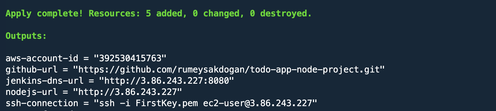
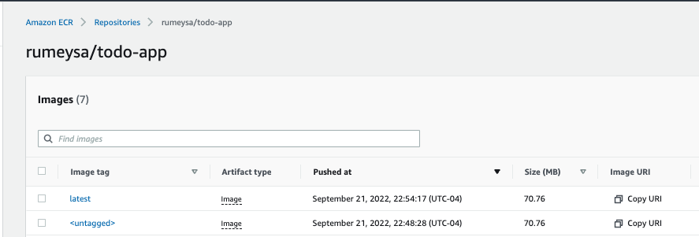
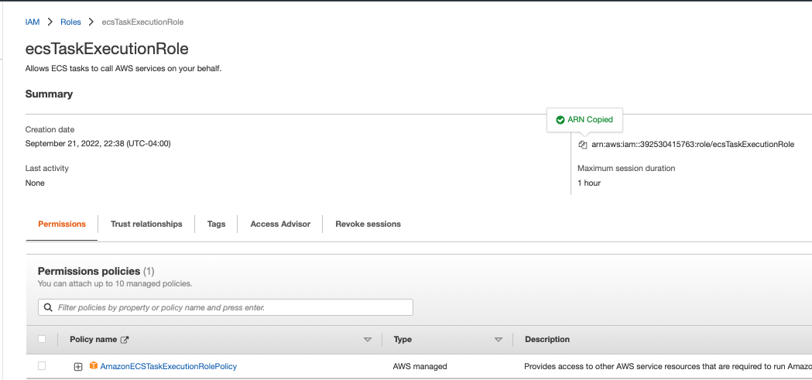
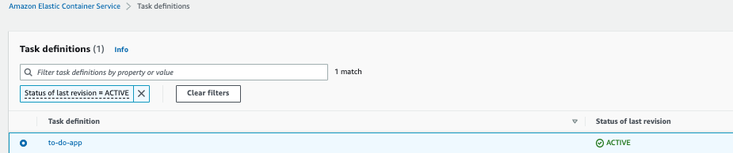
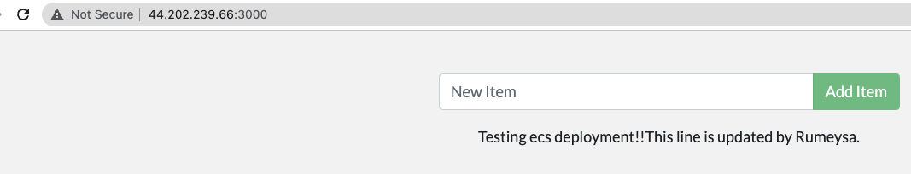
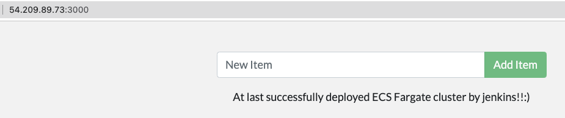

# Hands-on ECR-02 : Jenkins Pipeline to Deploy Docker Images on ECR to ECS cluster

Purpose of the this hands-on training is to teach the students how to build Jenkins pipeline to create Docker image and push the image to AWS Elastic Container Registry (ECR) and deploy them on ECS Cluster.

## Learning Outcomes

At the end of the this hands-on training, students will be able to;

- create and configure AWS ECR from the AWS Management Console.

- configure Jenkins Server with Git, Docker, AWS CLI on Amazon Linux 2 EC2 instance using Terraform file.

- demonstrate how to build a docker image with Dockerfile.

- build Jenkins pipelines with Jenkinsfile.

- integrate Jenkins pipelines with GitHub using Webhook.

- configure Jenkins Pipeline to build a NodeJS project.

- use Docker commands effectively to tag, push, and pull images to/from ECR.

- create repositories on ECR from the AWS Management Console.

- Deploy application to AWS ECS using jenkins pipeline.

- delete images and repositories on ECR from the AWS CLI.

## Outline

- Part 1 - Launching a Jenkins Server Configured for ECR Management

- Part 2 - Prepare the Image Repository on ECR and Project Repository on GitHub with Webhook

- Part 3 - Creating Jenkins Pipeline for the Project with GitHub Webhook

- Part 4 - Cleaning up the Image Repository on AWS ECR and ECS cluster

## Part 1 - Launching a Jenkins Server Configured for ECR Management

- Add token to the github. So, go to your github Account Profile  on right of the top >>>> Settings>>>>Developer Settings>>>>>>>>Personal access tokens >>>>>> Generate new token.

- Paste this created token to the necessary place in the terraform file. Change required places that need to be changed in the terraform file.

- Launch a pre-configured `Jenkins Server` from the terraform file running on Amazon Linux 2, allowing SSH (port 22) and HTTP (ports 80, 8080) connections.  

- Open your Jenkins dashboard and navigate to `Manage Jenkins` >> `Manage Plugins` >> `Available` tab

- Search and select `GitHub Integration, Pipeline: GitHub, Docker, Docker Pipeline` plugins, then click to `Install without restart`. Note: No need to install the other `Git plugin` which is already installed can be seen under `Installed` tab.


## Part 2 - Prepare the Image Repository on ECR and Project Repository on GitHub with Webhook

### Step-1: Prepare the Image Repository on ECR

- Create a docker image repository `rumeysa/todo-app` on AWS ECR from Management Console.
```text
Visibility settings     : Private
Repository name         :  <your account ID>.dkr.ecr.us-east-1.amazonaws.com/rumeysa/todo-app
Tag immutability        : Disable
Image scan settings     : Disable
Encryption settings     : Disable
```

### Step-2: Create Webhook 

- Go to the `todo-app-node-project` repository page and click on `Settings`.

- Click on the `Webhooks` on the left hand menu, and then click on `Add webhook`.

- Copy the Jenkins URL from the AWS Management Console, paste it into `Payload URL` field, add `/github-webhook/` at the end of URL, and click on `Add webhook`.

```text
http://ec2-54-144-151-76.compute-1.amazonaws.com:8080/github-webhook/
```

## Part 3 - Creating Jenkins Pipeline for the Project with GitHub Webhook

### Step-1: Github process

- Go to the Jenkins dashboard and click on `New Item` to create a pipeline.

- Enter `todo-app-pipeline` then select `Pipeline` and click `OK`.

- Enter `To Do App pipeline configured with Jenkinsfile and GitHub Webhook` in the description field.

- Put a checkmark on `GitHub Project` under `General` section, enter URL of the project repository.

```text
https://github.com/xxxxxxxx/todo-app-node-project.git
```

- Put a checkmark on `GitHub hook trigger for GITScm polling` under `Build Triggers` section.

- Go to the `Pipeline` section, and select `Pipeline script from SCM` in the `Definition` field.

- Select `Git` in the `SCM` field.

- Enter URL of the project repository, and let others be default.

```text
https://github.com/xxxxxxxxxxx/todo-app-node-project.git
```
- It shows "Failed to connect to repository :... " message. To give access to github repository click Add and select Jenkins. 
```
Domain  : Global credentials (unrestricted)
Kind    : Username with Password
Username: Github-token
Password: "Please paste here your Github token"
ID      : keep it as is
Description : This credentials for Github repository
```
Write a username and paste your github personnel access token in to the password part and click add button. After that select your credentials. 

- Click `apply` and `save`. Note that the script `Jenkinsfile` should be placed under root folder of repo.

### Step-2: Jenkins instance Process

- Go to the Jenkins instance (todo-app-node-project/ directory) to create `Jenkinsfile`

```bash
cd todo-app-node-project/
ls
vi Jenkinsfile

Press "i" to edit 
```
- Create a `Jenkinsfile` within the `todo-app-node-project` repo with following pipeline script. 
```groovy
pipeline {
    agent any
    stages {
        stage("Run app on Docker"){
            agent{
                docker{
                    image 'node:12-alpine'
                }
            }
            steps{
                withEnv(["HOME=${env.WORKSPACE}"]) {
                    sh 'yarn install --production'
                }   
            }
        }
    }
}
```

- explain withEnv(["HOME=${env.WORKSPACE}"]) the meaning of this line

- once we see the code is running, lets build its image. to do this, we should write Dockerfile based and configure the Jenkinsfile

- Go under todo-app-node-project/ folder and then create a Docker file via `vi` editor.

```bash
cd todo-app-node-project/
ls
vi Dockerfile
i
Press "i" to edit 
```

- Paste  the following content within a Dockerfile which will be located in `todo-app-node-project` repository.

```dockerfile
FROM node:12-alpine
WORKDIR /app
COPY . .
RUN yarn install --production
CMD ["node", "/app/src/index.js"]
```
- Press "ESC" and ":wq " to save.

```bash
vi Jenkinsfile

Press "i" to edit 
```

```groovy
pipeline {
    agent any
    environment {
        ECR_REGISTRY = "<aws_account_id>.dkr.ecr.us-east-1.amazonaws.com"
        APP_REPO_NAME= "rumeysa/todo-app"
    }
    stages {
        stage('Build Docker Image') {
            steps {
                sh 'docker build --force-rm -t "$ECR_REGISTRY/$APP_REPO_NAME:latest" .'
                sh 'docker image ls'
            }
        }
        stage('Push Image to ECR Repo') {
            steps {
                sh 'aws ecr get-login-password --region us-east-1 | docker login --username AWS --password-stdin "$ECR_REGISTRY"'
                sh 'docker push "$ECR_REGISTRY/$APP_REPO_NAME:latest"'
            }
        }
    }
    post {
        always {
            echo 'Deleting all local images'
            sh 'docker image prune -af'
        }
    }
}
```

- Press "ESC" and ":wq " to save.

- Commit and push the local changes to update the remote repo on GitHub.

```bash
git add .
git commit -m 'added Jenkinsfile'
git push
```
- Explain, why we got `Error: Cannot perform an interactive login from a non TTY deviceAdd` error and add the following line into ```environment``` section in the Jenkins file.

```text
PATH="/usr/local/bin/:${env.PATH}"
```

### Step-3: Make change to trigger Jenkins

- Now, to trigger an automated build on Jenkins Server, we need to change code in the repo. For example, in the `src/static/js/app.js` file, update line 56 of `<p className="text-center">No items yet! Add one above!</p>` with following new text.

```html
vi src/static/js/app.js
 <p className="text-center">You have no todo task yet! Go ahead and add one!</p>
```

- Commit and push the change to the remote repo on GitHub.

```bash
git add .
git commit -m 'updated app.js'
git push
```
- if you want to manually run 

```bash
aws ecr get-login-password --region us-east-1 | docker login --username AWS --password-stdin <aws_account_id>.dkr.ecr.us-east-1.amazonaws.com
```

- Then run the image

```bash
docker run --name todo -dp 80:3000 <aws_account_id>.dkr.ecr.us-east-1.amazonaws.com/rumeysa/todo-app:latest
```
- Delete the container 

```bash
docker container stop todo
docker container rm todo
```

### Step 4 Add Deploy stage 

- Go to the Jenkins instance (todo-app-node-project/ directory)to create `Jenkinsfile`
```bash
cd todo-app-node-project/
ls
vi Jenkinsfile

Press "i" to edit 
```

- Change a `Jenkinsfile` within the `todo-app-node-project` repo and add Deploy stage like below.

- First press "dG" to delete all

```groovy
  pipeline {
    agent any
    environment {
        ECR_REGISTRY = "<aws_account_id>.dkr.ecr.us-east-1.amazonaws.com"
        APP_REPO_NAME= "rumeysa/todo-app"
        PATH="/usr/local/bin/:${env.PATH}"
    }
    stages {
        stage('Build Docker Image') {
            steps {
                sh 'docker build --force-rm -t "$ECR_REGISTRY/$APP_REPO_NAME:latest" .'
                sh 'docker image ls'
            }
        }
        stage('Push Image to ECR Repo') {
            steps {
                sh 'aws ecr get-login-password --region us-east-1 | docker login --username AWS --password-stdin "$ECR_REGISTRY"'
                sh 'docker push "$ECR_REGISTRY/$APP_REPO_NAME:latest"'
            }
        }
        stage('Deploy') {
            steps {
                sh 'aws ecr get-login-password --region us-east-1 | docker login --username AWS --password-stdin "$ECR_REGISTRY"'
                sh 'docker pull "$ECR_REGISTRY/$APP_REPO_NAME:latest"'
                sh 'docker rm -f todo | echo "there is no docker container named todo"'
                sh 'docker run --name todo -dp 80:3000 "$ECR_REGISTRY/$APP_REPO_NAME:latest"'
            }
        }

    }
    post {
        always {
            echo 'Deleting all local images'
            sh 'docker image prune -af'
        }
    }
}
```

- Press "ESC" and ":wq " to save.

- Commit and push the local changes to update the remote repo on GitHub.

```bash
git add .
git commit -m 'added Jenkinsfile'
git push
```

### Step 5 Deploy to the ECS cluster

- Createa ECS cluster with a unique name with the following command.

```bash
aws ecs create-cluster --cluster-name to-do-app
```

- Create a task definition file and name it as to-do-app.json. Don't forget the `<aws-account-id>` parts.

```json
{
	"family": "to-do-app",
	"networkMode": "awsvpc",
	"containerDefinitions": [{
		"name": "to-do-app",
		"image": "<aws-account-id>.dkr.ecr.us-east-1.amazonaws.com/rumeysa/todo-app:latest",
		"portMappings": [{
			"containerPort": 3000,
			"protocol": "tcp"
		}],
		"essential": true
	}],
	"requiresCompatibilities": [
		"FARGATE"
	],
	"cpu": "256",
	"memory": "512",
        "executionRoleArn": "arn:aws:iam::<aws-account-id>:role/ecsTaskExecutionRole"
}
```

Note: If you don't have ecsTaskExecutionRole, you can create as below.

```bash
Use case : Elastic Container Service >>> Elastic Container Service task
Policy.  : AmazonECSTaskExecutionRolePolicy
Name     : PolicyforECS
```

- Register the task definition with the following command.

```bash
aws ecs register-task-definition --cli-input-json file://to-do-app.json
```

- List the task definitions.

```bash
aws ecs list-task-definitions
```

- Create a service with following command.

```bash
aws ecs create-service --cluster to-do-app --service-name to-do-app-service --task-definition to-do-app --desired-count 1 --launch-type "FARGATE" --network-configuration "awsvpcConfiguration={subnets=[subnet-077c9758],securityGroups=[sg-e29b36ce],assignPublicIp=ENABLED}" # change the subnets and security group and make sure that the 3000 port is open. 
```

> Note: securityGroups=[sg-e29b36ce] is default sg. If we don't specify any sg, aws assign default sg to the cluster.

- Change a `Jenkinsfile` within the `todo-app-node-project` repo and add Deploy stage like below.

```groovy
pipeline {
    agent any
    environment {
        ECR_REGISTRY = "<aws-account-id>.dkr.ecr.us-east-1.amazonaws.com"
        APP_REPO_NAME= "rumeysa/todo-app"
    }
    stages {
        stage('Build Docker Image') {
            steps {
                sh 'docker build --force-rm -t "$ECR_REGISTRY/$APP_REPO_NAME:latest" .'
                sh 'docker image ls'
            }
        }
        stage('Push Image to ECR Repo') {
            steps {
                sh 'aws ecr get-login-password --region us-east-1 | docker login --username AWS --password-stdin "$ECR_REGISTRY"'
                sh 'docker push "$ECR_REGISTRY/$APP_REPO_NAME:latest"'
            }
        }
        stage('Deploy') {
            steps {
                sh 'aws ecs update-service --cluster to-do-app --desired-count 1 --service to-do-app-service --task-definition to-do-app --force-new-deployment'
            }
        }
    }
    post {
        always {
            echo 'Deleting all local images'
            sh 'docker image prune -af'
        }
    }
}
```

- Press "ESC" and ":wq " to save.

- Commit and push the local changes to update the remote repo on GitHub.

```bash
git add .
git commit -m 'Deploy to the ecs cluster is added'
git push
```

- Check the <ecs task Public IP:3000> page.

### Step 6 Make change to trigger again 

- Change the script to make trigger.

```html
vi src/static/js/app.js
 <p className="text-center">You have no todo task yet! Go ahead and add one more!</p>
```

- Commit and push the change to the remote repo on GitHub.

```bash
git add .
git commit -m 'updated app.js'
git push
```

- Check the <ecs task Public IP:3000> page.

## Part 4 - Cleaning up the Image Repository on AWS ECR and ECS cluster

- If necessary, authenticate the Docker CLI to your default `ECR registry`.

```bash
aws ecr get-login-password --region us-east-1 | docker login --username AWS --password-stdin <aws_account_id>.dkr.ecr.us-east-1.amazonaws.com
```

- Delete the ECR repository `rumeysa-repo/todo-app` from AWS CLI.

```bash
aws ecr delete-repository \
      --repository-name rumeysa/todo-app \
      --force \
      --region us-east-1
```

- Delete the service and ecs cluster.

```bash
aws ecs delete-service --cluster to-do-app --service to-do-app-service --force
aws ecs delete-cluster --cluster to-do-app
```