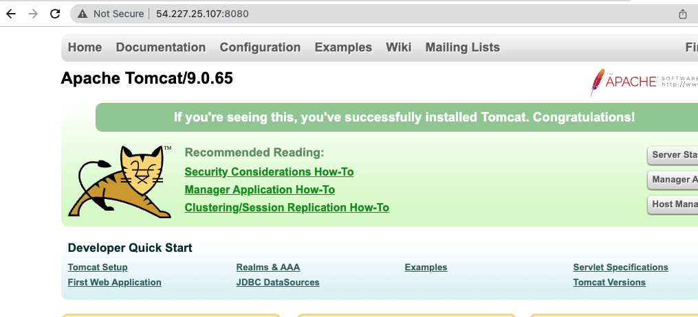
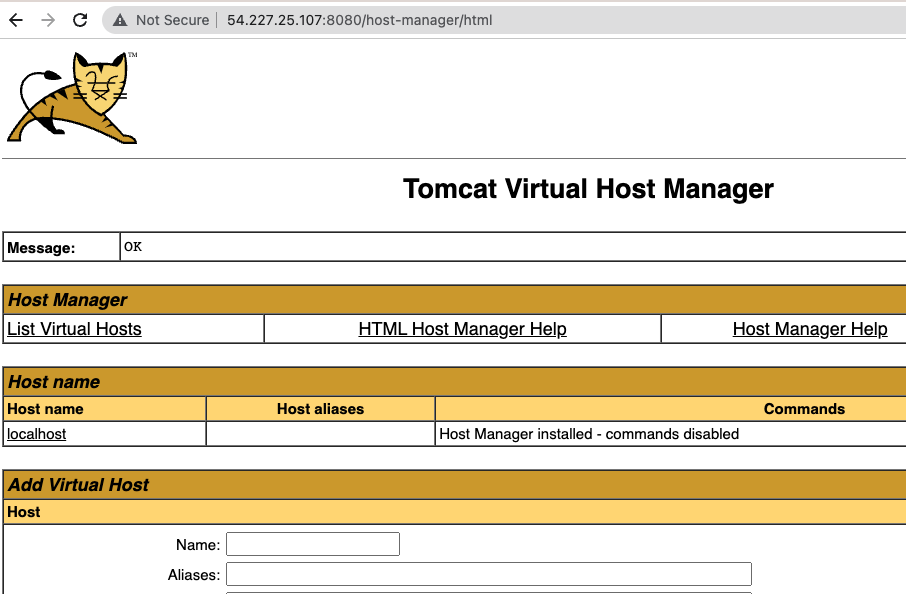

# Hands-on Jenkins-04 : Install & Configure Tomcat on Amazon Linux 2 AWS EC2 Instances

Purpose of the this hands-on training is to install & configure Tomcat server for staging and prodcution environment.

## Learning Outcomes

At the end of the this hands-on training, students will be able to;

- install and configure Tomcat server.


## Outline

- Part 1 - Launch an EC-2 free tier instance and connect using SSH

- Part 2 - Install Java JDK

- Part 3 - Install Tomcat

- Part 4 - Configure Tomcat

- Part 5 - Auto start of tomcat server at boot

## Part 1 - Launch an EC-2 free tier instance and connect using SSH

- The security group must allow  SSH (port 22) and TCP (8080)

- connect to EC-2 free tier instance
  
```bash
ssh -i .ssh/mykey.pem ec2-user@ec2-3-133-106-98.us-east-2.compute.amazonaws.com
```

## Part 2 - Install Java JDK

- Install Java

- For Centos & Fedora (Amazon ec-2 instance)
```bash
sudo yum install java-1.8.0-openjdk -y
```

## Part 3 - Install Tomcat


- For Centos & Fedora (Amazon ec-2 instance)
  
```bash
sudo yum install unzip wget -y
```

- Install Tomcat

- Got to https://tomcat.apache.org/download-80.cgi page

- Look at Binary Distributions and copy the link of the `zip`ed one.

```bash
...
Core:
zip (pgp, sha512) [select this for linux, thus copy the link]
tar.gz (pgp, sha512)
32-bit Windows zip (pgp, sha512)
64-bit Windows zip (pgp, sha512)
32-bit/64-bit Windows Service Installer (pgp, sha512)
...
```

-  Get the tomcat file
  
```bash
cd /tmp
wget https://dlcdn.apache.org/tomcat/tomcat-9/v9.0.63/bin/apache-tomcat-9.0.63.zip
```

- Unzip tomcat file and move to `/opt`
  
```bash
unzip apache-tomcat-*.zip
sudo mv apache-tomcat-9.0.63 /opt/tomcat
```

## Part 4 - Configure tomcat

- Now Change Tomcat Server Port

- Go to /opt/tomcat/conf/server.xml file

- Search for `Connector` and verify/change the Port Value, save the file.

```bash
    <Connector port="8080" protocol="HTTP/1.1"
               connectionTimeout="20000"
               redirectPort="8443" />
```

- Change Permission of Scripts in `/opt/tomcat/bin`

```bash
cd /opt/tomcat/bin
ls -la
sudo chmod +x *
```

- Set Credentials of Tomcat that Jenkins will use.

```bash
cd /opt/tomcat/conf
```
- Update `tomcat-users.xml` file.

- `manager-script` & `admin-gui` are needed for jenkins to access tomcat.

- Set roles as `manager-script` & `admin-gui` and set password to tomcat as follows:

```bash
  <role rolename="manager-script"/>
  <role rolename="admin-gui"/>
  <user username="tomcat" password="tomcat" roles="manager-script,admin-gui"/>
```

- Note : Don't forget to remove the xml comment bloks `<!--` and `-->`. Delete these enclosing lines.

- To configure Tomcat server we need to modify the content of the context.xml. Be careful there are two of this file. We have to modify both of them.

- Go to the `/opt/tomcat/webapps/host-manager/META-INF/` and edit file `context.xml`. Actually commenting out the tagged `CookieProcessor` and `Valve` parts.

```bash
<?xml version="1.0" encoding="UTF-8"?>
<!--
  Licensed to the Apache Software Foundation (ASF) under one or more
  contributor license agreements.  See the NOTICE file distributed with
  this work for additional information regarding copyright ownership.
  The ASF licenses this file to You under the Apache License, Version 2.0
  (the "License"); you may not use this file except in compliance with
  the License.  You may obtain a copy of the License at

      http://www.apache.org/licenses/LICENSE-2.0

  Unless required by applicable law or agreed to in writing, software
  distributed under the License is distributed on an "AS IS" BASIS,
  WITHOUT WARRANTIES OR CONDITIONS OF ANY KIND, either express or implied.
  See the License for the specific language governing permissions and
  limitations under the License.
-->
<Context antiResourceLocking="false" privileged="true" >
	<!--
  <CookieProcessor className="org.apache.tomcat.util.http.Rfc6265CookieProcessor"
                   sameSiteCookies="strict" />
  <Valve className="org.apache.catalina.valves.RemoteAddrValve"
         allow="127\.\d+\.\d+\.\d+|::1|0:0:0:0:0:0:0:1" />
	-->
  <Manager sessionAttributeValueClassNameFilter="java\.lang\.(?:Boolean|Integer|Long|Number|String)|org\.apache\.catalina\.filters\.CsrfPreventionFilter\$LruCache(?:\$1)?|java\.util\.(?:Linked)?HashMap"/>
</Context>
```

- Go to the `/opt/tomcat/webapps/manager/META-INF/` and edit file `context.xml`. Actually commenting out the tagged `CookieProcessor` and `Valve` parts.

```bash
<?xml version="1.0" encoding="UTF-8"?>
<!--
  Licensed to the Apache Software Foundation (ASF) under one or more
  contributor license agreements.  See the NOTICE file distributed with
  this work for additional information regarding copyright ownership.
  The ASF licenses this file to You under the Apache License, Version 2.0
  (the "License"); you may not use this file except in compliance with
  the License.  You may obtain a copy of the License at

      http://www.apache.org/licenses/LICENSE-2.0

  Unless required by applicable law or agreed to in writing, software
  distributed under the License is distributed on an "AS IS" BASIS,
  WITHOUT WARRANTIES OR CONDITIONS OF ANY KIND, either express or implied.
  See the License for the specific language governing permissions and
  limitations under the License.
-->
<Context antiResourceLocking="false" privileged="true" >
<!--
  <CookieProcessor className="org.apache.tomcat.util.http.Rfc6265CookieProcessor"
	sameSiteCookies="strict" />
  <Valve className="org.apache.catalina.valves.RemoteAddrValve"
         allow="127\.\d+\.\d+\.\d+|::1|0:0:0:0:0:0:0:1" />
-->
  <Manager sessionAttributeValueClassNameFilter="java\.lang\.(?:Boolean|Integer|Long|Number|String)|org\.apache\.catalina\.filters\.CsrfPreventionFilter\$LruCache(?:\$1)?|java\.util\.(?:Linked)?HashMap"/>
</Context>
```


- Restart the tomcat server

```bash
/opt/tomcat/bin/shutdown.sh
/opt/tomcat/bin/startup.sh
```

## Part 5 - Auto start of Tomcat server at boot

- In able to auto start Tomcat server at boot, we have to make it a `service`. Service is process that starts with operating system and runs in the background without interacting with the user.

- Service files are located in /etc/systemd/system.

- Go to /etc/systemd/system folder.

```bash
cd /etc/systemd/system
```

- In able to declare a service "unit file" must be created. Create a `tomcat.service` file.

```bash
sudo vi tomcat.service
```

- Copy and paste this code in "tomcat.service" file.
```
[Unit]
Description=Apache Tomcat Web Application Container
After=syslog.target network.target

[Service]
Type=forking

Environment=JAVA_HOME=/usr/lib/jvm/jre
Environment=CATALINA_PID=/opt/tomcat/temp/tomcat.pid
Environment=CATALINA_HOME=/opt/tomcat
Environment=CATALINA_BASE=/opt/tomcat
Environment='CATALINA_OPTS=-Xms512M -Xmx1024M -server -XX:+UseParallelGC'
Environment='JAVA_OPTS=-Djava.awt.headless=true -Djava.security.egd=file:/dev/./urandom'

ExecStart=/opt/tomcat/bin/startup.sh
ExecStop=/bin/kill -15 $MAINPID

[Install]
WantedBy=multi-user.target
```

- Save and exit.

- Enable Tomcat server.

```bash
sudo systemctl enable tomcat
```

- Start Tomcat server.

```bash
sudo systemctl start tomcat
```

- Open your browser, get your Tomcat server ec2 instance Public IPv4 DNS and paste it at address bar with 8080. 
"http://[ec2-public-dns-name]:8080"





