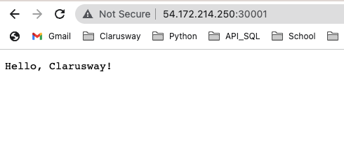

# Hands-on Kubernetes-05 : Managing Secrets and ConfigMaps

Purpose of the this hands-on training is to give students the knowledge of Kubernetes Secrets and config-map

## Learning Outcomes

At the end of the this hands-on training, students will be able to;

- Explain the Kubernetes Secrets

- Share sensitive data (such as passwords) using Secrets.

- Learn configuration management for applications in Kubernetes using ConfigMaps.

## Outline

- Part 1 - Setting up the Kubernetes Cluster

- Part 2 - Kubernetes Secrets

- Part 3 - ConfigMaps in Kubernetes

## Part 1 - Setting up the Kubernetes Cluster

- Launch a Kubernetes Cluster of Ubuntu 20.04 with two nodes (one master, one worker) using the [Cloudformation Template to Create Kubernetes Cluster](../kubernetes-02-basic-operations/cfn-template-to-create-k8s-cluster.yml). *Note: Once the master node up and running, worker node automatically joins the cluster.*

>*Note: If you have problem with kubernetes cluster, you can use this link for lesson.*
>https://www.katacoda.com/courses/kubernetes/playground

- Check if Kubernetes is running and nodes are ready.

```bash
kubectl cluster-info
kubectl get no
```

## Part 2 - Kubernetes Secrets

## Creating your own Secrets 

### Creating a Secret Using kubectl

- Secrets can contain user credentials required by Pods to access a database. For example, a database connection string consists of a username and password. You can store the username in a file ./username.txt and the password in a file ./password.txt on your local machine.

```bash
# Create files needed for the rest of the example.
echo -n 'admin' > ./username.txt
echo -n '1f2d1e2e67df' > ./password.txt
```

- The kubectl create secret command packages these files into a Secret and creates the object on the API server. The name of a Secret object must be a valid DNS subdomain name. Show types of secrets with opening : (Kubetnetes Secret Types)[https://kubernetes.io/docs/concepts/configuration/secret/]

```bash
$ kubectl create secret generic db-user-pass --from-file=./username.txt --from-file=./password.txt
```

- The output is similar to:

```bash
secret "db-user-pass" created
```

- Default key name is the filename. You may optionally set the key name using `[--from-file=[key=]source]`.

```bash
$ kubectl create secret generic db-user-pass-key --from-file=username=./username.txt --from-file=password=./password.txt
```

>Note:
>Special characters such as `$`, `\`, `*`, `=`, and `!` will be interpreted by your shell and require escaping. In most shells, the easiest way to escape the password is to surround it with single quotes (`'`). For example, if your actual password is S!B\*d$zDsb=, you should execute the command this way:
>
>```bash
>kubectl create secret generic dev-db-secret --from-literal=username=devuser --from-literal=password='S!B\*d$zDsb='
>```
>You do not need to escape special characters in passwords from files (--from-file).

- You can check that the secret was created:

```bash
$ kubectl get secrets
```

- The output is similar to:

```bash
NAME                  TYPE                                  DATA      AGE
db-user-pass          Opaque                                2         51s
```

You can view a description of the secret:

```bash
$ kubectl describe secrets/db-user-pass
```

Note: The commands kubectl get and kubectl describe avoid showing the contents of a secret by default. This is to protect the secret from being exposed accidentally to an onlooker, or from being stored in a terminal log.

The output is similar to:
```bash
Name:            db-user-pass
Namespace:       default
Labels:          <none>
Annotations:     <none>

Type:            Opaque

Data
====
password.txt:    12 bytes
username.txt:    5 bytes
```

### Creating a Secret manually 

- You can also create a Secret in a file first, in JSON or YAML format, and then create that object. The name of a Secret object must be a valid DNS subdomain name. The Secret contains two maps: data and stringData. The data field is used to store arbitrary data, encoded using base64. The stringData field is provided for convenience, and allows you to provide secret data as unencoded strings.

- For example, to store two strings in a Secret using the data field, convert the strings to base64 as follows:

```bash
$ echo -n 'admin' | base64
```

- The output is similar to:

```bash
YWRtaW4=
```

```bash
$ echo -n '1f2d1e2e67df' | base64
```

- The output is similar to:

```bash
MWYyZDFlMmU2N2Rm
```

- Write a Secret that looks like this named secret.yaml:

```yaml
apiVersion: v1
kind: Secret
metadata:
  name: mysecret
type: Opaque
data:
  username: YWRtaW4=
  password: MWYyZDFlMmU2N2Rm
```

- Now create the Secret using `kubectl apply`:

```bash
$ kubectl apply -f ./secret.yaml
```

- The output is similar to:

```bash
secret "mysecret" created
```

### Decoding a Secret

- Secrets can be retrieved by running kubectl get secret. For example, you can view the Secret created in the previous section by running the following command:

```bash
kubectl get secret mysecret -o yaml
```

- The output is similar to:

```yaml
apiVersion: v1
data:
  password: MWYyZDFlMmU2N2Rm
  username: YWRtaW4=
kind: Secret
metadata:
  annotations:
    kubectl.kubernetes.io/last-applied-configuration: |
      {"apiVersion":"v1","data":{"password":"MWYyZDFlMmU2N2Rm","username":"YWRtaW4="},"kind":"Secret","metadata":{"annotations":{},"name":"mysecret","namespace":"default"},"type":"Opaque"}
  creationTimestamp: "2021-10-06T12:51:08Z"
  name: mysecret
  namespace: default
  resourceVersion: "38986"
  uid: fb55a84e-24f5-461d-a000-e7dab7c34200
type: Opaque
```

- Decode the password field:

```bash
$ echo 'MWYyZDFlMmU2N2Rm' | base64 --decode
```

- The output is similar to:

```bash
1f2d1e2e67df
```

### Using Secrets 

- This is an example of a Pod that uses secrets from environment variables:

- mysecret-pod.yaml

```yaml
apiVersion: v1
kind: Pod
metadata:
  name: secret-env-pod
spec:
  containers:
  - name: mycontainer
    image: redis
    env:
      - name: SECRET_USERNAME
        valueFrom:
          secretKeyRef:
            name: mysecret
            key: username
      - name: SECRET_PASSWORD
        valueFrom:
          secretKeyRef:
            name: mysecret
            key: password
  restartPolicy: Never
```

- Create the pod.

```bash
$ kubectl apply -f mysecret-pod.yaml
```

### Consuming Secret Values from environment variables

- Inside a container that consumes a secret in an environment variables, the secret keys appear as normal environment variables containing the base64 decoded values of the secret data. This is the result of commands executed inside the container from the example above:

- Enter into pod and type following command.

```bash
kubectl exec -it secret-env-pod -- bash
root@secret-env-pod:/data# echo $SECRET_USERNAME
admin
root@secret-env-pod:/data# echo $SECRET_PASSWORD
1f2d1e2e67df
```

## Part 3 - ConfigMaps in Kubernetes

- A ConfigMap is a dictionary of configuration settings. This dictionary consists of key-value pairs of strings. Kubernetes provides these values to your containers. Like with other dictionaries (maps, hashes, ...) the key lets you get and set the configuration value.

- A ConfigMap stores configuration settings for your code. Store connection strings, public credentials, hostnames, environment variables, container command line arguments and URLs in your ConfigMap.

- ConfigMaps bind configuration files, command-line arguments, environment variables, port numbers, and other configuration artifacts to your Pods' containers and system components at runtime.

- ConfigMaps allow you to separate your configurations from your Pods and components. 

- ConfigMap helps to makes configurations easier to change and manage, and prevents hardcoding configuration data to Pod specifications.

- ConfigMaps are useful for storing and sharing non-sensitive, unencrypted configuration information.

- For the show case we will select a simple application that displays a message like this.

```text
Hello, Clarusway!
```

- We will parametrized the "Hello" portion in some languages.

```bash
$ mkdir k8s
$ cd k8s/
```

- Create 2 files.

- deployment.yaml

```yaml
apiVersion: apps/v1
kind: Deployment
metadata:
  name: demo
  labels:
    app: demo
spec:
  replicas: 1
  selector:
    matchLabels:
      app: demo
  template:
    metadata:
      labels:
        app: demo
    spec:
      containers:
        - name: demo
          image: clarusway/demo:hello
          ports:
          - containerPort: 8888
```

- service.yaml

```yaml
apiVersion: v1
kind: Service
metadata:
  name: demo-service
  labels:
    app: demo
spec:
  type: NodePort
  ports:
  - port: 80
    targetPort: 8888
    nodePort: 30001    
  selector:
    app: demo
```

- See the files and go upper folder.

```bash
$ ls
deployment.yaml  service.yaml
$ cd .. 
```

- Now apply `kubectl` to these files.

```bash
$ kubectl apply -f k8s
deployment.apps/demo created
service/demo-service created
```

Let's see the message.

```bash
$ kubectl get svc demo-service -o wide
NAME           TYPE           CLUSTER-IP    EXTERNAL-IP   PORT(S)        AGE     SELECTOR
demo-service   LoadBalancer   10.97.39.39   <pending>     80:30001/TCP   2m20s   app=demo

$ curl < worker-ip >:30001
Hello, Clarusway!
```
This is the default container behaviour.

Now delete what we have created.

```bash
$ kubectl delete -f k8s
deployment.apps "demo" deleted
service "demo-service" deleted
```

- We have modified the application to take the greeting message as a parameter (environmental variable). So we will expose configuration data into the container’s environmental variables. Firstly, let's see how to pass environment variables to pods. 

The modified `deployment.yaml` file.

```yaml
apiVersion: apps/v1
kind: Deployment
metadata:
  name: demo
spec:
  replicas: 1
  selector:
    matchLabels:
      app: demo
  template:
    metadata:
      labels:
        app: demo
    spec:
      containers:
        - name:  demo
          image: clarusway/demo:hello-config-args
          imagePullPolicy: Always
          args:
            - "-greeting"
            - "$(GREETING)"
          ports:
            - containerPort: 8888
          env:
            - name: GREETING
              value: selam 
```

Apply `kubectl` to these files.

```bash
$ kubectl apply -f deployment.yaml  
deployment.apps/demo created
$ kubectl apply -f  service.yaml
service/demo-service created
```
- Check the output on your browser. 

- This time we will expose configuration data into the container’s environmental variables. And,  we will create `ConfigMap` and use the `greeting` key-value pair as in the `deployment.yaml` file.

The modified `deployment.yaml` file.

```yaml
apiVersion: apps/v1
kind: Deployment
metadata:
  name: demo
spec:
  replicas: 1
  selector:
    matchLabels:
      app: demo
  template:
    metadata:
      labels:
        app: demo
    spec:
      containers:
        - name:  demo
          image: clarusway/demo:hello-config-args
          imagePullPolicy: Always
          args:
            - "-greeting"
            - "$(GREETING)"
          ports:
            - containerPort: 8888
          env:
            - name: GREETING
              valueFrom:
                configMapKeyRef:
                  name: demo-config
                  key: greeting
```
Note the application run parameter (`args`) and `ConfigMap` reference in container section.

## Create and use ConfigMaps with `kubectl create configmap` command

There are three ways to create ConfigMaps using the `kubectl create configmap` command. Here are the options.

1. Use the contents of an entire directory with `kubectl create configmap my-config --from-file=./my/dir/path/`
   
2. Use the contents of a file or specific set of files with `kubectl create configmap my-config --from-file=./my/file.txt`
   
3. Use literal key-value pairs defined on the command line with `kubectl create configmap my-config --from-literal=key1=value1 --from-literal=key2=value2`

### Literal key-value pairs

We will start with the third option. We have just one parameter. Greet with "Halo" in Spanish.

```bash
$ kubectl create configmap demo-config --from-literal=greeting=Hola
```

- Explain the important parts in `ConfigMap` file contents.

```yaml
$ kubectl get configmap/demo-config -o yaml
apiVersion: v1
data:
  greeting: Halo
kind: ConfigMap
metadata:
  creationTimestamp: "2021-10-06T13:01:20Z"
  name: demo-config
  namespace: default
  resourceVersion: "39879"
  uid: 9673e114-3bbe-43e5-9e88-b3478ccc0794
```

- Apply `kubectl` to these files.

```bash
$ kubectl apply -f deployment.yaml  
deployment.apps/demo created
$ kubectl apply -f  service.yaml
service/demo-service created
```

- List the services.

```bash
$ kubectl get svc -o wide
NAME           TYPE           CLUSTER-IP     EXTERNAL-IP   PORT(S)        AGE   SELECTOR
demo-service   LoadBalancer   10.97.162.15   <pending>     80:30001/TCP   15s   app=demo
kubernetes     ClusterIP      10.96.0.1      <none>        443/TCP        46d   <none>
```

- See the message.

```bash
$ curl < worker-ip >:30001
Halo, Clarusway!
```

- Reset what we have created.

```bash
$ kubectl get cm
NAME          DATA   AGE
demo-config   1      15m

$ kubectl delete cm demo-config 
configmap "demo-config" deleted

$ kubectl delete -f service.yaml
service "demo-service" deleted

$ kubectl delete -f deployment.yaml
deployment.apps "demo" deleted
```

### From a config file

- We will write the greeting key-value pair in a file in Norvegian and create the ConfigMap from this file.

```bash
echo "greeting: Hei" > config
```

Note that, the comman notation used in key-value pairs is to use `key= value` notation, but this is not an obligatory. The notation actualy depends on the applicaton implementation that will parse and use these files.

- Look at the other example files that look like below

```bash
$ ls 
game.properties
ui.properties

$ cat game.properties
enemies=aliens
lives=3
enemies.cheat=true
enemies.cheat.level=noGoodRotten
secret.code.passphrase=UUDDLRLRBABAS
secret.code.allowed=true
secret.code.lives=30

$ cat ui.properties
color.good=purple
color.bad=yellow
allow.textmode=true
how.nice.to.look=fairlyNice
```

- Let's create our configmap from `config` file.

```bash
$ kubectl create configmap demo-config --from-file=./config
configmap/demo-config created
```

- Check the content of the `configmap/demo-config`.

```json
$ kubectl get  configmap/demo-config -o json
{
    "apiVersion": "v1",
    "data": {
        "config": "greeting: Hei\n"
    },
    "kind": "ConfigMap",
    "metadata": {
        "creationTimestamp": "2021-10-06T13:04:14Z",
        "name": "demo-config",
        "namespace": "default",
        "resourceVersion": "40173",
        "uid": "8bbeed1d-d516-4db8-b50e-c0fdb7f4f0c2"
    }
}
```

We have modifed our application to read parameters from the file. So the `deployment` file changed as follows:

```yaml
$ cat deployment.yaml 
apiVersion: apps/v1
kind: Deployment
metadata:
  name: demo
spec:
  replicas: 1
  selector:
    matchLabels:
      app: demo
  template:
    metadata:
      labels:
        app: demo
    spec:
      containers:
        - name:  demo
          image: clarusway/demo:hello-config-file
          ports:
            - containerPort: 8888
          volumeMounts:
          - mountPath: /config/
            name: demo-config-volume
            readOnly: true
      volumes:
      - name: demo-config-volume
        configMap:
          name: demo-config
          items:
          - key: config
            path: demo.yaml
```

- Volume and volume mounting are common ways to place config files inside a container. We are selecting `config` key from `demo-config` ConfigMap and put it inside the container at path `/config/` with the name `demo.yaml`.

- Apply and run all the configurations as follow:

```bash
$ kubectl apply -f deployment.yaml 
deployment.apps/demo created

$ kubectl get po
NAME                   READY   STATUS    RESTARTS   AGE
demo-77496d887-rhkww   1/1     Running   0          4s

$ kubectl apply -f service.yaml 
service/demo-service created

$ kubectl get svc -o wide
NAME           TYPE        CLUSTER-IP       EXTERNAL-IP   PORT(S)        AGE   SELECTOR
demo-service   NodePort    10.108.181.197   <none>        80:30001/TCP   11s   app=demo
kubernetes     ClusterIP   10.96.0.1        <none>        443/TCP        14h   <none>

$ curl < worker-ip >:30001
Hei, Clarusway!
```

- Reset what we have created.

```bash
$ kubectl get cm
NAME          DATA   AGE
demo-config   1      15m
$ kubectl delete cm demo-config 
configmap "demo-config" deleted
$ kubectl delete -f service.yaml
service "demo-service" deleted
$ kubectl delete -f deployment.yaml
deployment.apps "demo" deleted
```

## From a ConfigMap YAML file

- This has the same steps and configuration with the `From a config file`

The ConfigMap YAML file

```yaml
$ cat configmap.yaml
apiVersion: v1
kind: ConfigMap
metadata:
  name: demo-config
data:
  config: |
    greeting: Buongiorno
```

- Note the greeting message is changed.

```yaml
$ cat deployment.yaml
apiVersion: apps/v1
kind: Deployment
metadata:
  name: demo
spec:
  replicas: 1
  selector:
    matchLabels:
      app: demo
  template:
    metadata:
      labels:
        app: demo
    spec:
      containers:
        - name:  demo
          image: clarusway/demo:hello-config-file
          ports:
            - containerPort: 8888
          volumeMounts:
          - mountPath: /config/
            name: demo-config-volume
            readOnly: true
      volumes:
      - name: demo-config-volume
        configMap:
          name: demo-config
          items:
          - key: config
            path: demo.yaml
```

- `Service` is the same.

```bash
$ kubectl apply -f configmap.yaml
configmap/demo-config created
$ kubectl apply -f deployment.yaml 
deployment.apps/demo created
$ kubectl apply -f service.yaml 
service/demo-service created
$ kubectl get po
NAME                   READY   STATUS    RESTARTS   AGE
demo-77496d887-bljb8   1/1     Running   0          12s
$ kubectl get svc -o wide
NAME           TYPE           CLUSTER-IP       EXTERNAL-IP   PORT(S)        AGE   SELECTOR
demo-service   LoadBalancer   10.107.176.127   <pending>     80:30001/TCP   16s   app=demo
kubernetes     ClusterIP      10.96.0.1        <none>        443/TCP        46d   <none>
$ curl < worker-ip >:30001
Buongiorno, Clarusway!
```

- Reset what we have created.
```bash
$ kubectl delete cm demo-config 
configmap "demo-config" deleted
$ kubectl delete -f service.yaml
service "demo-service" deleted
$ kubectl delete -f deployment.yaml
deployment.apps "demo" deleted
```

## Configure all key-value pairs in a ConfigMap as container environment variables

- We will update the `configmap.yaml` as follows:

```yaml
apiVersion: v1
kind: ConfigMap
metadata:
  name: demo-config
data:
  greeting: Hola
```

- We will update the `deployment.yaml` as follows:

```yaml
apiVersion: apps/v1
kind: Deployment
metadata:
  name: demo
spec:
  replicas: 1
  selector:
    matchLabels:
      app: demo
  template:
    metadata:
      labels:
        app: demo
    spec:
      containers:
        - name:  demo
          image: clarusway/demo:hello-config-env
          ports:
            - containerPort: 8888
          env:
            - name: GREETING
              valueFrom:
                configMapKeyRef:
                  name: demo-config
                  key: greeting
```

Note that this time, we are not placing the `GREETING` as run arguments. This time we will inject this variable as `environment variable`.

```bash
$ kubectl apply -f k8s
configmap/demo-config created
deployment.apps/demo created
service/demo-service created

$ kubectl get svc
NAME           TYPE        CLUSTER-IP       EXTERNAL-IP   PORT(S)        AGE
demo-service   NodePort    10.102.145.186   <none>        80:30001/TCP   5s
kubernetes     ClusterIP   10.96.0.1        <none>        443/TCP        14h

$ curl < worker-ip >:30001
Hola, Clarusway!
```

- Reset what we have created.

```bash
$ kubectl delete -f k8s
configmap "demo-config" deleted
deployment.apps "demo" deleted
service "demo-service" deleted
```

## Configure all key-value pairs in a ConfigMap as container environment variables in POSIX format

- In case if you are using envFrom  instead of env  to create environmental variables in the container, the environmental names will be created from the ConfigMap's keys. If a ConfigMap  key has invalid environment variable name, it will be skipped but the pod will be allowed to start. 

Modify configmap.yaml file:

```yaml
apiVersion: v1
kind: ConfigMap
metadata:
  name: demo-config
data:
  GREETING: Merhaba
```

The environmental variables are directly filled in `configmap.yaml`. They are in capital letters.

- `deployment.yaml` file:

```yaml
apiVersion: apps/v1
kind: Deployment
metadata:
  name: demo
spec:
  replicas: 1
  selector:
    matchLabels:
      app: demo
  template:
    metadata:
      labels:
        app: demo
    spec:
      containers:
        - name:  demo
          image: clarusway/demo:hello-config-env
          ports:
            - containerPort: 8888
          envFrom:
          - configMapRef:
              name: demo-config
```

Note the change as follows:

```yaml
...
          envFrom:
          - configMapRef:
              name: demo-config
```

- You can compare with the previos `deployment.yaml` file.

```bash
$ kubectl apply -f k8s
configmap/demo-config created
deployment.apps/demo created
service/demo-service created
```

```bash
$ kubectl get svc
NAME           TYPE           CLUSTER-IP       EXTERNAL-IP   PORT(S)        AGE
demo-service   LoadBalancer   10.110.195.109   <pending>     80:32711/TCP   17s
kubernetes     ClusterIP      10.96.0.1        <none>        443/TCP        46d

$ curl < worker-ip >:32711
Merhaba, Clarusway!
```

Everything works fine!

```bash
$ kubectl delete -f k8s
configmap "demo-config" deleted
deployment.apps "demo" deleted
service "demo-service" deleted
```


### Optional

Here is the challenge:

* Use our hello app from clarusway repo. And to call the $GREETINGS env use secrets.
