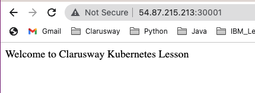
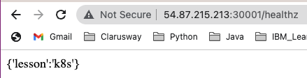

# Hands-on Kubernetes-09: Kubernetes Liveness, Readiness and Startup Probes

The purpose of this hands-on training is to give students the knowledge of how to configure liveness, readiness and startup probes for containers.

## Learning Outcomes

At the end of this hands-on training, students will be able to;

- configure liveness, readiness and startup probes for containers

## Outline

- Part 1 - Setting up the Kubernetes Cluster

- Part 2 - livenessProbe

- Part 3 - readinessProbe

- Part 4 - startupProbe

## Part 1 - Setting up the Kubernetes Cluster

- Launch a Kubernetes Cluster of Ubuntu 20.04 with two nodes (one master, one worker).

>*Note: If you have a problem with the Kubernetes cluster, you can use this link for the lesson.*
>https://www.katacoda.com/courses/kubernetes/playground

- Check if Kubernetes is running and nodes are ready.

```bash
kubectl cluster-info
kubectl get node
```

## Part 2 - livenessProbe

- The kubelet uses liveness probes to know when to restart a container. For example, liveness probes could catch a deadlock, where an application is running, but unable to make progress. Restarting a container in such a state can help to make the application more available despite bugs.

- Create a `http-liveness.yaml` and input text below.

```yaml
apiVersion: v1
kind: Pod
metadata:
  labels:
    test: liveness
  name: liveness-http
spec:
  containers:
  - name: liveness
    image: clarusway/probes
    livenessProbe:
      httpGet:
        path: /healthz
        port: 80
      initialDelaySeconds: 3
      periodSeconds: 3
---
apiVersion: v1
kind: Service   
metadata:
  name: liveness-svc
spec:
  type: NodePort  
  ports:
  - port: 80
    targetPort: 80
    nodePort: 30001
  selector:
    test: liveness
```

- In the configuration file, you can see that the Pod has a single container. 

- The `periodSeconds` field specifies that the kubelet should perform a `liveness probe every 3 seconds`. 

- The `initialDelaySeconds` field tells the kubelet that it should `wait 3 seconds before performing the first probe`. 

- To perform a probe, the kubelet sends an `HTTP GET request` to the server that is running in the container and listening on port 80. If the handler for the server's `/healthz` path returns a success code, the kubelet considers the container to be alive and healthy. If the handler returns a failure code, the kubelet kills the container and restarts it.

- Any code `greater than or equal to 200 and less than 400` indicates `success`. Any other code indicates `failure`.

- For the `first 30 seconds` that the container is alive, the `/healthz` handler returns a status of `200`. After that, the handler returns a status of `500`.

```py
app = Flask(__name__)

start = time.time()

@app.route("/healthz")
def health_check():
    end = time.time()
    duration = end - start
    if duration < 30:
        return Response("{'lesson':'k8s'}", status=200)

if __name__== '__main__':
    app.run(host="0.0.0.0", port=80)
```

- The kubelet starts performing health checks 3 seconds after the container starts. So the first couple of health checks will succeed. But after 30 seconds, the health checks will fail, and `the kubelet will kill and restart the container`.
- application is successful and reachable through Nodeport  
  


- health check succesful and returning 200 OK
  


- heath check failed , returning 500
  


- To try the HTTP liveness check, create a Pod:

```bash
kubectl apply -f http-liveness.yaml
```

- After 30 seconds, view Pod events to verify that liveness probes have failed and the container has been restarted:

```bash
kubectl get po
kubectl describe pod liveness-http
```

- Delete the pod.

```bash
kubectl delete -f http-liveness.yaml
```

### Define a livenessProbe that executes command in the container

- Another kind of liveness probe that executes the command in the contianer.

- Create a `liveness-exec.yaml` and input text below.

```yaml
apiVersion: v1
kind: Pod
metadata:
  labels:
    test: liveness
  name: liveness-exec
spec:
  containers:
  - name: liveness
    image: clarusway/probes
    args:
    - /bin/sh
    - -c
    - touch /tmp/healthy; sleep 30; rm -rf /tmp/healthy; sleep 600
    livenessProbe:
      exec:
        command:
        - cat
        - /tmp/healthy
      initialDelaySeconds: 5
      periodSeconds: 5
```

- Create the pod with `liveness-exec.yaml` command.

```bash
kubectl apply -f liveness-exec.yaml
```

- In the configuration file, you can see that the Pod has a single Container. 

- The `periodSeconds` field specifies that the kubelet should perform a liveness probe every 5 seconds. 

- The `initialDelaySeconds` field tells the kubelet that it should wait 5 seconds before performing the first probe. 

- To perform a probe, the kubelet executes the command `cat /tmp/healthy` in the target container. If the command succeeds, it returns `0`, and the kubelet considers the container to be alive and healthy. If the command returns a `non-zero value`, the kubelet kills the container and restarts it.

- When the container starts, it executes this command:

```bash
/bin/sh -c "touch /tmp/healthy; sleep 30; rm -rf /tmp/healthy; sleep 600"
```

- For the first 30 seconds of the container's life, there is a /tmp/healthy file. So during the first 30 seconds, the command cat /tmp/healthy returns a success code. After 30 seconds, cat /tmp/healthy returns a failure code.

- view the Pod events.

```bash
kubectl get po
kubectl describe pod liveness-exec
```

- Delete the pod.

```bash
kubectl delete -f liveness-exec.yaml
```

### Define a TCP liveness probe 

### Define a TCP liveness probe 

- A third type of liveness probe uses a `TCP socket`. With this configuration, the kubelet will attempt to open a socket to your container on the specified port. If it can establish a connection, the container is considered healthy, if it can't it is considered a failure.

- Create a `tcp-liveness.yaml` and input text below.

```yaml
apiVersion: v1
kind: Pod
metadata:
  name: liveness-tcp
spec:
  containers:
  - name: liveness-tcp
    image: mysql
    ports:
    - containerPort: 3306
    env:
        - name: MYSQL_ROOT_PASSWORD
          value: "123456"
    livenessProbe:
      tcpSocket:
        port: 8080
      initialDelaySeconds: 15
      periodSeconds: 20
```

- As you can see, configuration for a TCP check is quite similar to an HTTP check. The kubelet will run the first liveness probe 15 seconds after the container starts. This will attempt to connect to the mysql container on port 8080. If the liveness probe fails, the container will be restarted.

- To try the TCP liveness check, create a Pod:

```bash
kubectl apply -f tcp-liveness.yaml
```

- After 15 seconds, view Pod events to verify that liveness probes:

```bash
kubectl describe pod liveness-tcp
```

- Change the tcpSocket port to 3306 and try again.

```bash
kubectl delete -f tcp-liveness.yaml
kubectl apply -f tcp-liveness.yaml
kubectl describe pod liveness-tcp
watch kubectl get po
```

## Part 3 - startupProbe

- The kubelet uses startup probes to know when a container application has started. If such a probe is configured, it disables liveness and readiness checks until it succeeds, making sure those probes don't interfere with the application startup. This can be used to adopt liveness checks on slow starting containers, avoiding them getting killed by the kubelet before they are up and running.

- Sometimes, you have to deal with legacy applications that might require an additional startup time on their first initialization. In such cases, it can be tricky to set up liveness probe parameters without compromising the fast response to deadlocks that motivated such a probe. The trick is to set up a `startup probe` with the same command, HTTP or TCP check, with a `failureThreshold * periodSeconds` long enough to cover the worse case startup time.

- Create a `startup.yaml` and input text below.

```yaml
apiVersion: v1
kind: Pod
metadata:
  labels:
    test: startup
  name: startup-http
spec:
  containers:
  - name: liveness
    image: clarusway/startupprobe
    livenessProbe:
      httpGet:
        path: /healthz
        port: 80
      initialDelaySeconds: 3
      periodSeconds: 3
    startupProbe:
      httpGet:
        path: /healthz
        port: 80
      failureThreshold: 5
      periodSeconds: 15
---
apiVersion: v1
kind: Service   
metadata:
  name: startup-svc
spec:
  type: NodePort  
  ports:
  - port: 80
    targetPort: 80
    nodePort: 30001
  selector:
    test: startup
```

> **failureThreshold:** When a probe fails, Kubernetes will try `failureThreshold` times before giving up. 


- In this image (clarusway/startupprobe), for the `first 60 seconds` the container returns a status of 500. Than the container will return a status of `200`. 

```py
app = Flask(__name__)

start = time.time()

@app.route('/')
def home():
    return "Welcome to Clarusway Kubernetes Lesson"

@app.route("/healthz")
def health_check():
    end = time.time()
    duration = end - start
    if duration > 60:
        return Response("{'lesson':'k8s'}", status=200)

if __name__== '__main__':
    app.run(host="0.0.0.0", port=80)
```

- To try the startup check, create a Pod:

```bash
kubectl apply -f startup.yaml
kubectl get po
kubectl describe pod startup-http
```

- Thanks to the startup probe, the application will have a maximum of 75 seconds (5 * 15 = 75s) to finish its startup. Once the startup probe has succeeded once, the liveness probe takes over to provide a fast response to container deadlocks. If the startup probe never succeeds, the container is killed after 75s and subject to the pod's restartPolicy.

- Delete the pod.

```bash
kubectl delete -f startup.yaml
```

## Part 4 - readinessProbe

- The kubelet uses readiness probes to know when a container is ready to start accepting traffic. A Pod is considered ready when all of its containers are ready. One use of this signal is to control which Pods are used as backends for Services. When a Pod is not ready, it is removed from Service load balancers.

- Sometimes, applications are temporarily unable to serve traffic. For example, an application might need to load large data or configuration files during startup, or depend on external services after startup. In such cases, you don't want to kill the application, but you don't want to send it requests either. Kubernetes provides readiness probes to detect and mitigate these situations. A pod with containers reporting that they are not ready does not receive traffic through Kubernetes Services.

> **Note:** Readiness probes runs on the container during its whole lifecycle.

> **Caution:** Liveness probes do not wait for readiness probes to succeed. If you want to wait before executing a liveness probe you should use initialDelaySeconds or a startupProbe.

- Readiness probes are configured similarly to liveness probes. The only difference is that you use the readinessProbe field instead of the livenessProbe field.

- Configuration for HTTP and TCP readiness probes also remains identical to liveness probes.

- Readiness and liveness probes can be used in parallel for the same container. Using both can ensure that traffic does not reach a container that is not ready for it, and that containers are restarted when they fail.

- Create a `http-readiness.yaml` and input text below.

```yaml
apiVersion: apps/v1
kind: Deployment
metadata:
  name: readiness
spec:
  replicas: 3
  selector:
    matchLabels:
      test: readiness
  template:
    metadata:
      labels:
        test: readiness
    spec:
      containers:
      - name: readiness
        image: clarusway/readinessprobe
        ports:
        - containerPort: 80
        readinessProbe:
          httpGet:
            path: /healthz
            port: 80
          initialDelaySeconds: 3
          periodSeconds: 3
---
apiVersion: v1
kind: Service
metadata:
  name: readiness-http
spec:
  ports:
  - port: 80
    targetPort: 80
    nodePort: 30001
  selector:
    test: readiness
  type: NodePort
```

- In this image (clarusway/readinessprobe), for the `first 45 seconds` the container returns a status of 500. Than the container will return a status of `200`. 

```py
app = Flask(__name__)

start = time.time()

@app.route('/')
def home():
    return "Welcome to Clarusway Kubernetes Lesson"

@app.route("/healthz")
def health_check():
    end = time.time()
    duration = end - start
    if duration > 45:
        return Response("{'lesson':'k8s'}", status=200)

if __name__== '__main__':
    app.run(host="0.0.0.0", port=80)
```

- To try the HTTP readiness check, create a deployment and service:

```bash
kubectl apply -f http-readiness.yaml
```

- View the deployment, service and endpoint.

```bash
kubectl get deployment
kubectl get pod
kubectl get svc
kubectl get ep
kubectl describe ep readiness-http
```

- Before 45 seconds, view endpoint `NotReadyAddresses` fields to verify that the ports are running but they are excluded from endpoint.

- Delete a pod and see one of pod will be not ready for service. After 45 seconds, it will be included by endpoint again.

```bash
kubectl get pod
kubectl delete pod <pod_name>
kubectl get pod
kubectl describe ep readiness-http
```

- Delete the resources.

```bash
kubectl delete -f http-readiness.yaml
```

Resource:

- https://kubernetes.io/docs/tasks/configure-pod-container/configure-liveness-readiness-startup-probes/