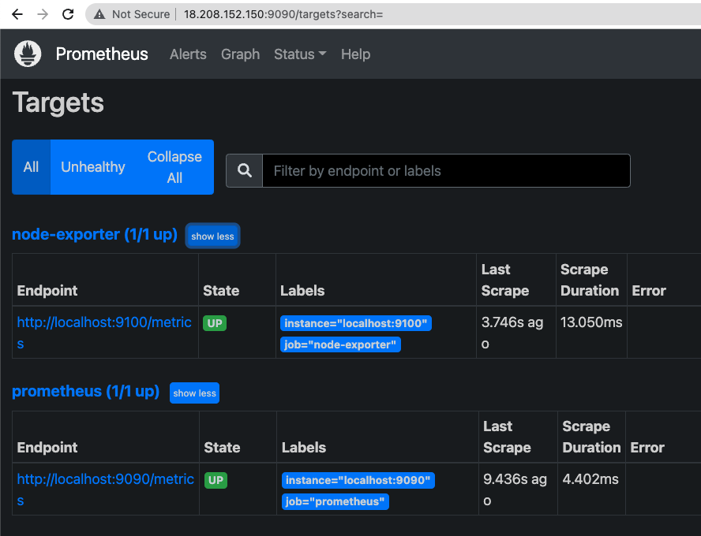
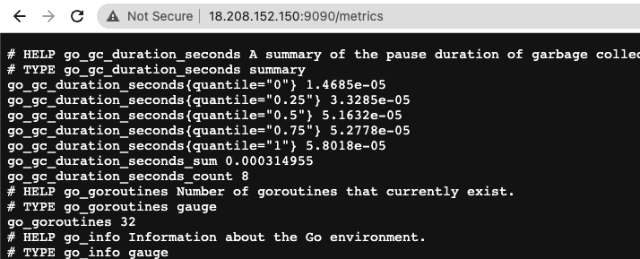
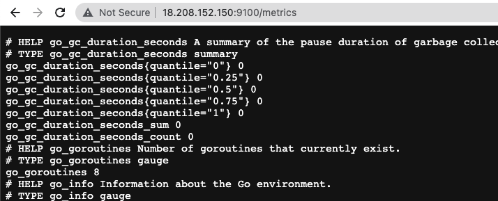
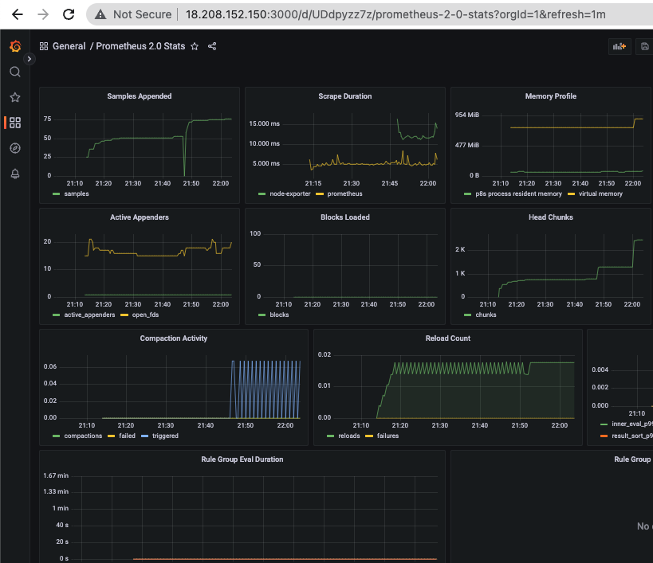

# Hands-on Prometheus & Grafana-01: Prometheus & Grafana Basic

Purpose of the this hands-on training is to give students the knowledge of basic operations about Prometheus & Grafana.

## Learning Outcomes

At the end of this hands-on training, students will be able to;

* Learn how to install Prometheus and Grafana
* Learn how to monitor with Prometheus
* Learn how to create a monitoring dashboard with Grafana

## Outline

- Part 1 - Install, configure, and use a simple Prometheus instance

- Part 2 - Monitoring with Prometheus WebUI

- Part 3 - Install, configure, and use a simple Grafana instance 

- Part 4 - Creating a monitoring dashboard with Grafana 

## Part 1 - Learn install, configure, and use a simple Prometheus instance

- Launch an Amazon EC2 instance with setting seen below: 

AMI: "Amazon Linux 2"  
Instance Type : "t2micro"  
Region: "N.Virginia"  
VPC: "Default VPC"  
Securtiy Group: "Port 22, 3000, 9090, 9100"  

- [Download the latest release](https://prometheus.io/download/) of Prometheus for linux. Select *.linux-*.tar.gz

```bash
wget https://github.com/prometheus/prometheus/releases/download/v2.38.0/prometheus-2.38.0.linux-amd64.tar.gz
```

Extract and run it.

```bash
tar xvfz prometheus-*.tar.gz
cd prometheus-*
```

- Check the basic prometheus configuration.

```
cat prometheus.yml
```

Output:

```yaml
# my global config
global:
  scrape_interval: 15s # Set the scrape interval to every 15 seconds. Default is every 1 minute.
  evaluation_interval: 15s # Evaluate rules every 15 seconds. The default is every 1 minute.
  # scrape_timeout is set to the global default (10s).

# Alertmanager configuration
alerting:
  alertmanagers:
    - static_configs:
        - targets:
          # - alertmanager:9093

# Load rules once and periodically evaluate them according to the global 'evaluation_interval'.
rule_files:
  # - "first_rules.yml"
  # - "second_rules.yml"

# A scrape configuration containing exactly one endpoint to scrape:
# Here it's Prometheus itself.
scrape_configs:
  # The job name is added as a label `job=<job_name>` to any timeseries scraped from this config.
  - job_name: "prometheus"

    # metrics_path defaults to '/metrics'
    # scheme defaults to 'http'.

    static_configs:
      - targets: ["localhost:9090"]
```

- Start Prometheus.

```bash
./prometheus --config.file=prometheus.yml
```

- Open the prometheus web UI from your browser.

```
http://<public ip>:9090
```

## Part 2 - Monitoring with Prometheus WebUI

- Check the default metrics of prometheus.

```
http://<public ip>:9090/metrics
```

- As you can gather from localhost:9090/metrics, one metric that Prometheus exports about itself is named prometheus_target_interval_length_seconds (the actual amount of time between target scrapes). Enter the below into the expression console and then click "Execute":

```
prometheus_target_interval_length_seconds
```

- This should return a number of different time series (along with the latest value recorded for each), each with the metric name prometheus_target_interval_length_seconds, but with different labels. These labels designate different latency percentiles and target group intervals.

- If we are interested only in 99th percentile latencies, we could use this query:

```
prometheus_target_interval_length_seconds{quantile="0.99"}
```

- To count the number of returned time series, you could write:

```
count(prometheus_target_interval_length_seconds)
```

For more about the expression language, see the [expression language documentation.](https://prometheus.io/docs/prometheus/latest/querying/basics/)


### Monitoring Linux Host Metrics with the Node Exporter

- Install and run the Prometheus Node Exporter that is a single static binary. Once you've downloaded it from the Prometheus downloads page extract it, and run it:

```bash
wget https://github.com/prometheus/node_exporter/releases/download/v1.3.1/node_exporter-1.3.1.linux-amd64.tar.gz
tar xvfz node_exporter-*.*-amd64.tar.gz
cd node_exporter-*.*-amd64
./node_exporter
```

- Check the metrics are being exported by curling the /metrics endpoint:

```bash
curl http://localhost:9100/metrics
```

or you can check from your browser.

```
http://<public ip>:9100/metrics
```

- Configuring your Prometheus instances. Update the prometheus.yml as below. 

```yaml
# my global config
global:
  scrape_interval: 15s # Set the scrape interval to every 15 seconds. Default is every 1 minute.
  evaluation_interval: 15s # Evaluate rules every 15 seconds. The default is every 1 minute.
  # scrape_timeout is set to the global default (10s).

# Alertmanager configuration
alerting:
  alertmanagers:
    - static_configs:
        - targets:
          # - alertmanager:9093

# Load rules once and periodically evaluate them according to the global 'evaluation_interval'.
rule_files:
  # - "first_rules.yml"
  # - "second_rules.yml"

# A scrape configuration containing exactly one endpoint to scrape:
# Here it's Prometheus itself.
scrape_configs:
  # The job name is added as a label `job=<job_name>` to any timeseries scraped from this config.
  - job_name: "prometheus"

    # metrics_path defaults to '/metrics'
    # scheme defaults to 'http'.

    static_configs:
      - targets: ["localhost:9090"]

  # configs for scraping node exporter metrics
  - job_name: node
    static_configs:
      - targets: ['localhost:9100']
```

- Stop and run prometheus again.

```bash
./prometheus --config.file=./prometheus.yml
```

- Check the following metrics on prometheus web UI.

| Metric | Meaning |
| -------- | ----------- |
| rate(node_cpu_seconds_total{mode="system"}[1m])   | The average amount of CPU time spent in system mode, per second, over the last minute (in seconds)                |
| node_filesystem_avail_bytes   | The filesystem space available to non-root users (in bytes)              |
| rate(node_network_receive_bytes_total[1m])   | The average network traffic received, per second, over the last minute (in bytes)           |

## Part 3 - Install, configure, and use a simple Grafana instance
	
- Download and install Grafana from this page. https://grafana.com/grafana/download

- Select `Red Hat, CentOS, RHEL, and Fedora(64 Bit)` part.

```bash
wget https://dl.grafana.com/enterprise/release/grafana-enterprise-9.1.5-1.x86_64.rpm
sudo yum install grafana-enterprise-9.1.5-1.x86_64.rpm
sudo systemctl start grafana-server.service
```

- By default, Grafana will be listening on http://localhost:3000. The default login is "admin" / "admin".
	
- Open http://< public ip>:3000 and login as "admin" / "admin".

### Creating a Prometheus data source

- Click on the "cogwheel" in the sidebar to open the Configuration menu.

- Click on "Data Sources".

- Click on "Add data source".

- Select "Prometheus" as the type.

- Set the appropriate Prometheus server URL (for example, http://localhost:9090/)

- Adjust other data source settings as desired (for example, choosing the right Access method).

- Click "Save & Test" to save the new data source.

### Creating a Prometheus graph

- Click the graph title, then click "Edit".

- Under the "Metrics" tab, select your Prometheus data source (bottom right).

- Enter any Prometheus expression into the "Query" field, while using the "Metric" field to lookup metrics via autocompletion.

- To format the legend names of time series, use the "Legend format" input. For example, to show only the method and status labels of a returned query result, separated by a dash, you could use the legend format string {{method}} - {{status}}.

- Tune other graph settings until you have a working graph.

### Importing pre-built dashboards from Grafana.com

- Grafana.com maintains [a collection of shared dashboards](https://grafana.com/grafana/dashboards/) which can be downloaded and used with standalone instances of Grafana. Type `node exporter` to search part and select a `node exporter dashboard`. And, click the `Copy ID to Clipboard`.
 
- On your grafana web UI (http://<public ip>:3000)

  - Click Dashboards button.

  - Select import

  - Paste the `id of the dashboard` (eg. 12486) to `Import via grafana.com` part and click `load`.

- Monitor the dashboard.

# Resources:

- https://prometheus.io/docs/prometheus/latest/getting_started/

- https://prometheus.io/docs/guides/node-exporter/

- https://prometheus.io/docs/visualization/grafana/#importing-pre-built-dashboards-from-grafana-com