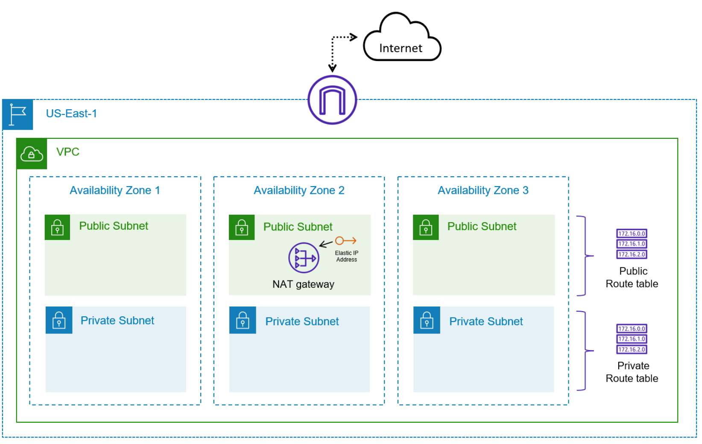

# Lab Instructions

You have been tasked with deploying some basic infrastructure on AWS to host a proof of concept environment. The architecture needs to include both public and private subnets and span multiple Availability Zones to test failover and disaster recovery scenarios. You expect to host Internet-facing applications. Additionally, you have other applications that need to access the Internet to retrieve security and operating system updates.

- Task1: Create a new VPC in your account in the US-East-1 region
- Task2: Create public and private subnets in three different Availability Zones
- Task3: Deploy an InternetGateway and attach it to the VPC
- Task4: Provision a NAT Gateway (a single instance will do) for outbound connectivity
- Task5: Ensure that route tables are configured to properly route traffic based on the requirements
- Task6: Delete the VPC resources
- Task7: Prepare files and credentials for using Terraform to deploy cloud resources
- Task8: Set credentials for Terraform deployment
- Task9: Deploy the AWS infrastructure using Terraform
- Task10: Delete the AWS resources using Terraform to cleanup  our AWS environment 

The end state of the AWS environment should look similar to the following diagram:

