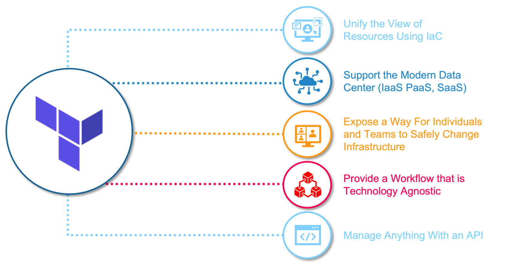
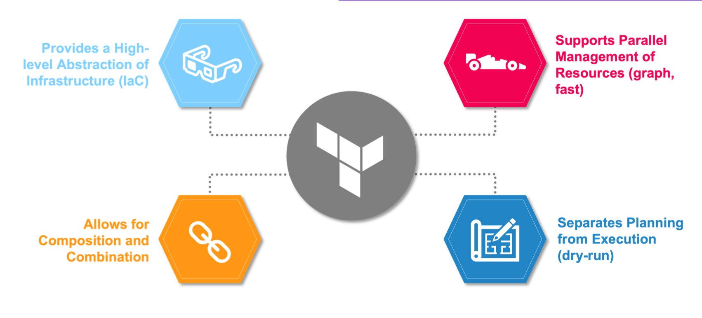

## Terraform Goals

- Unify the view of resources using infrastructure as code
- Support the modern data center(IaaS,PaaS,SaaS)
- Expose a way for individuals and teams to safely and predictably change infrastructure
- Provide a workflow that is technology agnostic
- Manage anything with an API
### Samples:
- [Terraform Provider for Dominos Pizza](https://github.com/nat-henderson/terraform-provider-dominos)
- [terraform-provider-spotify](https://github.com/conradludgate/terraform-provider-spotify)

## Terraform Benefits

- Provides a high-level abstraction of infrastructure(IaC)
- Allows for composition and combination
- Supports parallel management of resources(graph,fast)
- Separates planning from execution(dry-run)

