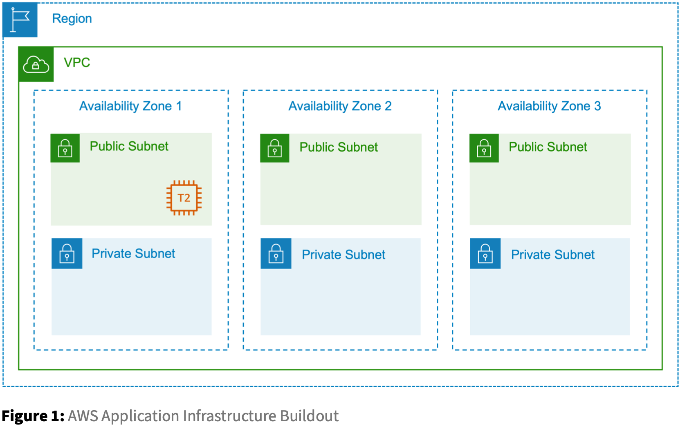

## Lab: Benefits of State

During execution, Terraform will examine the state of the currently running infrastructure, determine what differences exist between the current state and the revised desired state, and indicate the neces- sary changes that must be applied. When approved to proceed, only the necessary changes will be applied, leaving existing, valid infrastructure untouched.

- Task1: Show Current State
- Task2: Update your Configuration 
- Task3: Plan and Execute Changes
- Task4: Show New State

