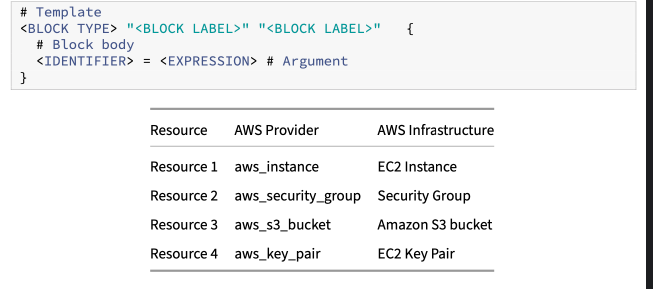

# Lab: Terraform Resource Blocks

Terraform uses resource blocks to manage infrastructure, such as virtual networks, compute instances, or higher-level components such as DNS records. Resource blocks represent one or more infrastructure objects in your Terraform configuration. Most Terraform providers have a number of different resources that map to the appropriate APIs to manage that particular infrastructure type.

When working with a specific provider, like AWS, Azure, or GCP, the resources are defined in the provider documentation. Each resource is fully documented in regards to the valid and required arguments required for each individual resource. For example, the `aws_key_pair` resource has a “Required” argument of `public_key` but optional arguments like `key_name` and `tags`. You’ll need to look at the provider documentation to understand what the supported resources are and how to define them in your Terraform configuration.

### Important :
Without `resource` blocks, Terraform is not going to create resources. All of the other block types, such as `variable`, `provider`, `terraform`, `output`, etc. are essentially supporting block types for the `resource` block.

- Task1: View and understand an existing resource block in Terraform
- Task2: Add a new resource to deploy an Amazon S3 bucket
- Task3: Create a new AWS security group
- Task4: Configure a resource from the random provider
- Task5: Update the Amazon S3 bucket to use the randomID

