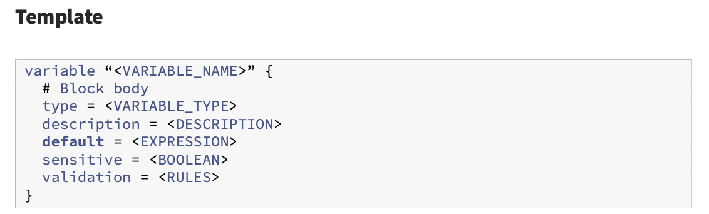

## Lab: Introduction to the Terraform Variables Block

As you being to write Terraform templates with a focus on reusability and DRY development (don’t repeat yourself), you’ll quickly being to realize that variables are going to simplify and increase usability for your Terraform configuration. Input variables allow aspects of a module or configuration to be customized without altering the module’s own source code. This allows modules to be shared between different configurations.

Input variables (commonly referenced as just ‘variables’) are often declared in a separate file called `variables.tf`, although this is not required. Most people will consolidate variable declaration in this file for organization and simplification of management. Each variable used in a Terraform configuration must be declared before it can be used. Variables are declared in a variable block - one block for each variable. The variable block contains the variable name, most importantly, and then often includes additional information such as the type, a description, a default value, and other options.

The variable block follows the following pattern:

The value of a Terraform variable can be set multiple ways, including setting a default value, interactively passing a value when executing a terraform plan and apply, using an environment variable, or setting the value in a `.tfvars` file. Each of these different options follows a strict order of precedence that Terraform uses to set the value of a variable.

- Task1: Add a new VPC resource block with static values
- Task2: Define new variable blocks to declare new variables
- Task3: Modify the value of the variable by adding defaults
