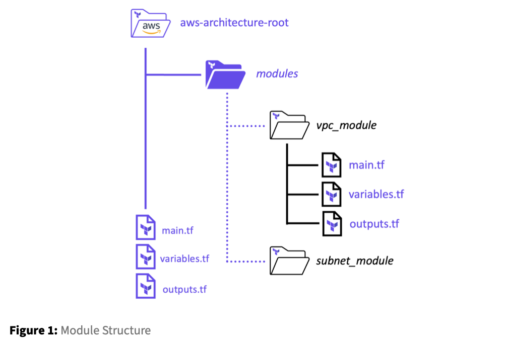

# Lab: Introduction to the Module Block

A module is used to combine resources that are frequently used together into a reusable container. Individual modules can be used to construct a holistic solution required to deploy applications. The goal is to develop modules that can be reused in a variety of different ways, therefore reducing the amount of code that needs to be developed. Modules are called by a `parent` or `root` module, and any modules called by the parent module are known as `child` modules.

Modules can be sourced from a number of different locations, including remote, such as the Terraform module registry, or locally within a folder. While not required, local modules are commonly saved in a folder named `modules`, and each module is named for its respective function inside that folder. An example of this can be found in the diagram below:



Modules are defined in a `module` block with a unique name for each module. Within the module block, the `source` indicates the local path of the module or the remote source where Terraform should download the module. You can also specify the `version` of the module to use, along with inputs that are passed to the child module.

### Template:

```bash
module “<MODULE_NAME>” {
  # Block body
  source = <MODULE_SOURCE>
<INPUT_NAME> = <DESCRIPTION> #Inputs
  <INPUT_NAME> = <DESCRIPTION> #Inputs
}
```
### Example:
```bash
module "website_s3_bucket" {
  source = "./modules/aws-s3-static-website-bucket"
  bucket_name = var.s3_bucket_name
  aws_region = "us-east-1"
tags = {
    Terraform   = "true"
    Environment = "certification"
} }
```

- Task1: Create a new module block to call a remote module
    - Task 1.1 Now that we’ve added the new module block,let’s first run a `terraform` init so Terraform can download the referenced module for us.
    - Task 1.2 Now that the module has been downloaded, let’s apply our new configuration. Keep in mind that this module only calculates subnets for us and returns those subnets as an output. It doesn’t create any resources in AWS. Run a `terraform apply -auto-approve` to apply the new configuration.
