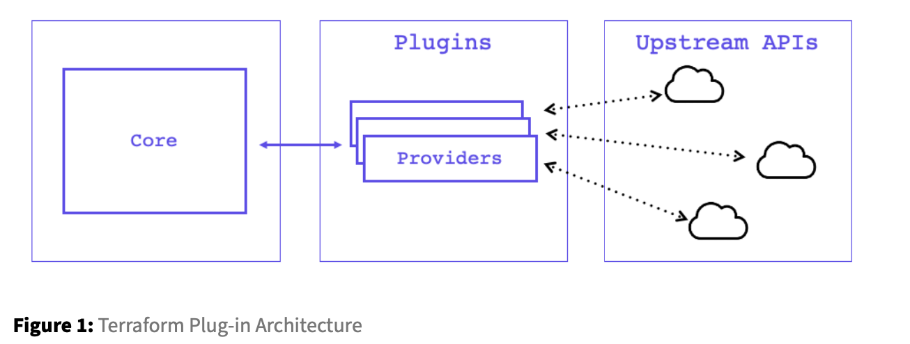

# Lab:Terraform Plug-in Based Architecture

Terraform relies on plugins called “providers” to interact with remote systems and expand functionality. Terraform configurations must declare which providers they require so that Terraform can install and use them. This is performed within a Terraform configuration block.

- Task1: View available Terraform Providers
- Task2: Install the Terraform AWS Provider
- Task3: View installed and required providers

[How Terraform works with Plug-Ins](https://www.terraform.io/plugin/how-terraform-works)

### Task1: View available Terraform Providers



[Terraform provider Registry](https://registry.terraform.io/)

### Task2: Install the Terraform AWS Provider

To install the Terraform AWS provider, and set the provider version in a way that is very similar to how you did for Terraform. To begin you need to let Terraform know to use the provider through a required_providers block in the terraform.tf file as seen below.

Run a terraform   init to install the providers specified in the configuration
```bash
terraform init
```

### Task3: View installed and required providers

If you ever would like to know which providers are installed in your working directory and those requiredbytheconfiguration,youcanissueaterraform versionandterraform providers command.

```bash
terraform version

Terraform v1.2.5
on darwin_amd64
+ provider registry.terraform.io/hashicorp/aws v3.75.2
+ provider registry.terraform.io/hashicorp/random v3.1.0
```
```bash
terraform providers

Providers required by configuration:
.
├── provider[registry.terraform.io/hashicorp/aws] ~> 3.0
└── provider[registry.terraform.io/hashicorp/random] 3.1.0
```

