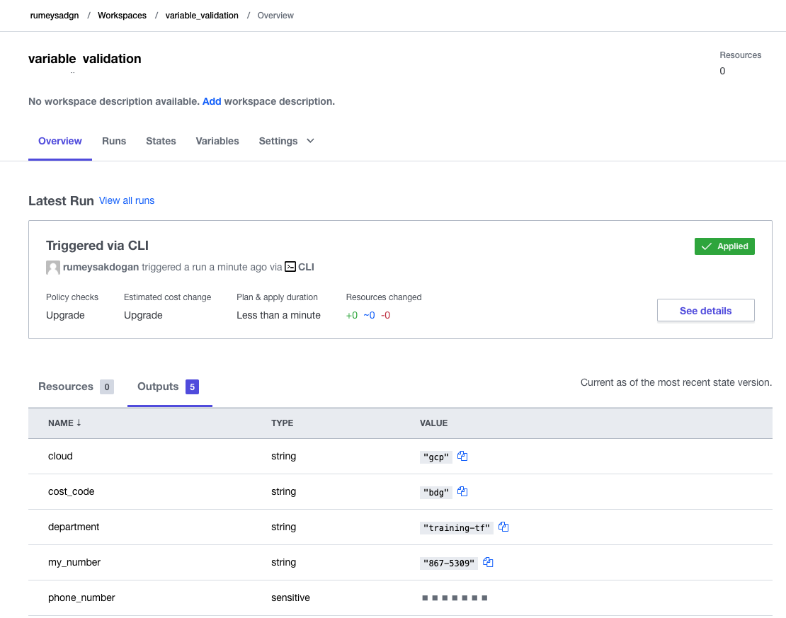

# Lab: Variable Validation and Suppression
We may want to validate and possibly suppress and sensitive information defined within our variables.
* Task1: Validate variables in a configuration block
* Task2: More Validation Options
* Task3: Suppress sensitive information
* Task4: View the Terraform State File
  
