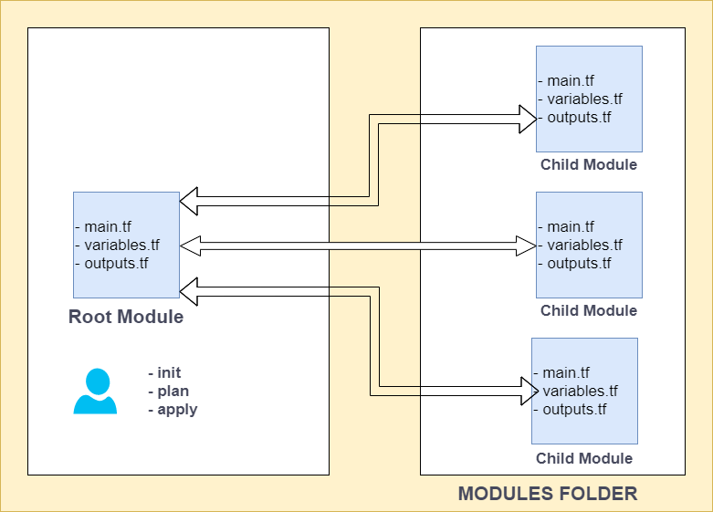

# Hands-on Terraform-04 : Terraform Modules and import.

Purpose of the this hands-on training is to give students the knowledge of terraform modules and import in Terraform.

## Learning Outcomes

At the end of the this hands-on training, students will be able to;

- Use Terraform modules.

- Use Terraform import.

## Outline

- Part 1 - Terraform Modules

- Part 2 - Terraform Import

## Part 1 - Terraform Modules

- A module is a container for multiple resources that are used together.

- The ``.tf`` files in your working directory when you run terraform plan or terraform apply together form the root module. That module may call other modules and connect them together by passing output values from one to input values of another.

-Create folders name `terraform-modules`, `modules`, `dev`, `prod` directories in the home directory and files as below.

```bash
mkdir terraform-modules && cd terraform-modules && mkdir dev modules prod && cd dev && touch dev-vpc.tf && cd ../modules && touch main.tf outputs.tf variables.tf && cd ../prod && touch prod-vpc.tf && cd ../modules
```

```txt
 terraform-modules
   ├── dev
   │   └── dev-vpc.tf
   ├── modules
   │   ├── main.tf
   │   ├── outputs.tf
   │   └── variables.tf
   └── prod
       └── prod-vpc.tf
```



- Go to the `modules/main.tf` file, add the followings.

```go
provider "aws" {
  region = "us-east-1"
}

resource "aws_vpc" "module_vpc" {
  cidr_block = var.vpc_cidr_block
  tags = {
    Name = "terraform-vpc-${var.environment}"
  }
}

resource "aws_subnet" "public_subnet" {
  cidr_block = var.public_subnet_cidr
  vpc_id = aws_vpc.module_vpc.id
  tags = {
    Name = "terraform-public-subnet-${var.environment}"
  }
}

resource "aws_subnet" "private_subnet" {
  cidr_block = var.private_subnet_cidr
  vpc_id = aws_vpc.module_vpc.id
  tags = {
    Name = "terraform-private-subnet-${var.environment}"
  }
}
```

# This is not a real public subnet. Because we didn't attach it to a internet gateway. It is the route table entries that make the subnets private or public.

- Go to the `modules/variables.tf` file, add the followings.

```go
variable "environment" {
  default = "clarusway"
}

variable "vpc_cidr_block" {
  default = "10.0.0.0/16"
  description = "this is our vpc cidr block"
}

variable "public_subnet_cidr" {
  default = "10.0.1.0/24"
  description = "this is our public subnet cidr block"
}

variable "private_subnet_cidr" {
  default = "10.0.2.0/24"
  description = "this is our private subnet cidr block"
}
```

- Go to the `modules/outputs.tf` file, add the followings.

```go
output "vpc_id" {
  value = aws_vpc.module_vpc.id
}

output "vpc_cidr" {
  value = aws_vpc.module_vpc.cidr_block
}

output "public_subnet_cidr" {
  value = aws_subnet.public_subnet.cidr_block
}

output "private_subnet_cidr" {
  value = aws_subnet.private_subnet.cidr_block
}
```

- Go to the `dev/dev-vpc.tf` file, add the followings.

```go
module "tf-vpc" {
  source = "../modules"
  environment = "DEV"
  }

output "vpc-cidr-block" {
  value = module.tf-vpc.vpc_cidr
}
```

- Go to the `prod/prod-vpc.tf` file, add the followings.

```go
module "tf-vpc" {
  source = "../modules"
  environment = "PROD"
  }

output "vpc-cidr-block" {
  value = module.tf-vpc.vpc_cidr
}
```

- Go to the `dev` folder and run the command below.

```bash
terraform init

terraform apply
```

- Go to the AWS console and check the VPC and subnets.

- Go to the `prod` folder and run the command below.

```bash
terraform init

terraform apply
```

- Go to the AWS console and check the VPC and subnets.

### Destroy

The `terraform destroy` command terminates resources defined in your Terraform configuration. This command is the reverse of terraform apply in that it terminates all the resources specified by the configuration. It does not destroy resources running elsewhere that are not described in the current configuration. 

- Go to the `prod` and  `dev` folders and run the command below.

```bash
terraform destroy -auto-approve
```

## Part 2 - Terraform Import

- Terraform is able to import existing infrastructure. 
- In this example, we have 2 `EC2 instances` (1 ubuntu, 1 linux 2), and a `security group` in our AWS account and we want to import these resources to our infrastructure.

- Bringing existing infrastructure under Terraform's control involves five main steps:

  1. Identify the existing infrastructure to be imported.
  2. Import infrastructure into your Terraform state.
  3. Write Terraform configuration that matches that infrastructure.
  4. Review the Terraform plan to ensure the configuration matches the expected state and infrastructure.
  5. Apply the configuration to update your Terraform state.

- First, go to the AWS console and create a security group name `tf-import-sg` and add tcp 22 (ssh) and tcp 80 (http) ports. Write `terraform import security group` to Security Group description. 

- Create two EC2 instances one's ami is `Amazon Linux 2` and the other is `Ubuntu 20.04`. Their tags will be `Name=aws-linux-2`, `Name=ubuntu-20.04` and `Name=tf-import-sg`.  Attach security group to these instances.

- Create a folder name `learn-terraform-import` and enter the directory.

```
mkdir learn-terraform-import
cd learn-terraform-import
```

- Create a file name `main.tf`. Add the followings according to the existing resources.

```
vim main.tf
```

```go
# main.tf

terraform {
  required_providers {
    aws = {
      source = "hashicorp/aws"
      version = "4.23.0"
    }
  }
}

provider "aws" {
  region = "us-east-1"
}

variable "tf-ami" {
  type = list(string)
  default = ["ami-0cff7528ff583bf9a", "ami-08d4ac5b634553e16", "ami-06640050dc3f556bb"]
}

variable "tf-tags" {
  type = list(string)
  default = ["aws-linux-2", "ubuntu-20.04", "red-hat-linux-8"]
}

resource "aws_instance" "tf-instances" {
  ami = element(var.tf-ami, count.index )
  instance_type = "t2.micro"
  count = 3
  key_name = "clarusway"
  security_groups = ["tf-import-sg"]
  tags = {
    Name = element(var.tf-tags, count.index )
  }
}

resource "aws_security_group" "tf-sg" {
  name = "tf-import-sg"
  description = "terraform import security group"
  tags = {
    Name = "tf-import-sg"
  }

  ingress {
    from_port   = 80
    protocol    = "tcp"
    to_port     = 80
    cidr_blocks = ["0.0.0.0/0"]
  }
  ingress {
    from_port   = 22
    protocol    = "tcp"
    to_port     = 22
    cidr_blocks = ["0.0.0.0/0"]
  }
  egress {
    from_port   = 0
    protocol    = -1
    to_port     = 0
    cidr_blocks = ["0.0.0.0/0"]
  }
}
```

- Open the terminal within this directory and nitialize the Terraform.

```bash
$ terraform init
```

- Go to the terraform registry and check the terraform aws instance import section. Then go to the AWS console, take the instance-id and import the "aws-linux-2" to the terraform management.

```bash
$ terraform import "aws_instance.tf-instances[0]" i-090291cc33c16504c


aws_instance.tf-instances[0]: Importing from ID "i-090291cc33c16504c"...
aws_instance.tf-instances[0]: Import prepared!
  Prepared aws_instance for import
aws_instance.tf-instances[0]: Refreshing state... [id=i-090291cc33c16504c]

Import successful!

The resources that were imported are shown above. These resources are now in
your Terraform state and will henceforth be managed by Terraform.
```

- Check the terraform.tfstate and import the second instance. (Take the ubuntu 20.04 instance-id from the console)

```bash
$ terraform import "aws_instance.tf-instances[1]" i-092fe70d1cef163c1


aws_instance.tf-instances[1]: Importing from ID "i-092fe70d1cef163c1"...
aws_instance.tf-instances[1]: Import prepared!
  Prepared aws_instance for import
aws_instance.tf-instances[1]: Refreshing state... [id=i-092fe70d1cef163c1]

Import successful!

The resources that were imported are shown above. These resources are now in
your Terraform state and will henceforth be managed by Terraform.
```

- Go to the terraform.tfstate and check it.

- Go to the terraform registry and check the aws_security_group import section. Then take security group id from the console and use it in the command.

```bash
$ terraform import aws_security_group.tf-sg sg-01b92e29e828a2177


aws_security_group.tf-sg: Importing from ID "sg-01b92e29e828a2177"...
aws_security_group.tf-sg: Import prepared!
  Prepared aws_security_group for import
aws_security_group.tf-sg: Refreshing state... [id=sg-01b92e29e828a2177]

Import successful!

The resources that were imported are shown above. These resources are now in
your Terraform state and will henceforth be managed by Terraform.
```

- Check the terraform.tfstate. These 3 resources are now in your Terraform state.

```bash
$ terraform state list
```

- Go to the terminal and un the command `terraform plan` and `terraform apply`.

```bash
$ terraform plan

$ terraform apply
```

- Go to the AWS console and check the resources. Now, our infrastructure are 3 EC2 instances, and a Security Group.

- Import is successful. Go to the terminal and terminate your infrastructure.

```bash
$ terraform destroy
```

- Visit the AWS console to see the terminated resources.